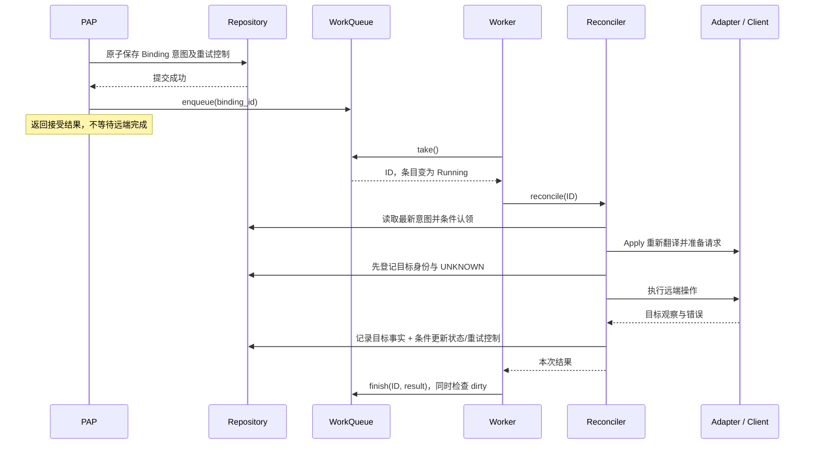

# Binding Reconciler 调度、存储与恢复设计

文档类型：`[TARGET V2]` 详细设计。本文定义目标行为、代码归属及分阶段验收要求；
实现进度和验证结果由对应 PR、CI 与验收报告记录。

持久化实施以 [Policy SQLite 持久化与崩溃恢复设计](POLICY_SQLITE_PERSISTENCE_DESIGN_zh.md)
为准：新建 `asc-policy-repository-sqlite`，Deployment 首版保存在 Binding 行内，内部
`status_version` 保护生命周期 CAS，部署观察独立合并。daemon 已使用该后端；
关闭重开、存储故障和 SIGKILL 恢复证据见该文档第 9 节，真实 PEP 与物理断电另验。

SCOPE-CR-002 已接入实现，并由 SQLite 保存：不可变 Scope 快照、系统 Binding 准入、停止发现后
异步清理和 Scope 显式重试。当前协议及测试入口见上述生命周期契约；旧 changed-spec
测试继续覆盖底层 revision/CAS 兼容能力，不表示开放用户 Binding mutation。

对象和意图来源以 [Policy/Scope/Binding 生命周期契约](POLICY_SCOPE_BINDING_CONTRACT_zh.md)
为准：Policy 有 revision 且只保存 current；Scope 是无 revision 的不可变 Assignment，
保存完整策略快照；Binding 不开放用户 mutation。本文旧 PAP Binding CRUD、changed-spec
UPDATE 与 Scope revision 相关流程保留为历史实现基线。新入口由 Scope/实例生命周期
产生 Binding 意图，复用本 Runtime 的调度、条件写和目标清理机制。

本文遵循 [Rust 迁移架构](AGENT_SEC_RUST_MIGRATION_zh.md)，补充并局部替代
[原详细方案](BINDING_RECONCILER_DESIGN_AND_IMPLEMENTATION_zh.md)的调度和存储提案。
它不是新增的 V1 行为契约，也不是当前 daemon、SQL 或真实 PEP 的验收报告。

初始交付边界：Runtime 集成 PR 完成 Runtime 实现与 daemon 接线，以单元、组件集成和调度竞争测试
验收；完整 CLI→daemon→Reconciler→mock AgentSight 端到端测试单独开 PR；系统性
error injection、进程崩溃和重启恢复测试在 persistent Repository 就绪后实施。
后两类测试不作为 Runtime 集成 PR 的完成门禁，具体分配见第 10 节。
SQLite 阶段现已实现故障注入与进程崩溃恢复测试，当前证据以持久化设计第 9 节为准。

## 1. 设计边界

1. Repository 是当前意图和目标部署责任的权威来源。通知只携带 Binding ID。
2. `asc-pcp` 每次完成一次执行尝试；核心决定是否重试、预算和退避时间，外部负责到期调度。
   失败等待期间释放 worker；采用这个方案，不采用在核心内 sleep 到下次尝试的循环。
3. WorkQueue 使用 FIFO 待领取队列和按 ID 索引的调度状态表；同 Binding 只有一个本地执行者。
4. 新 Delete 可以提前唤醒等待重试的 Binding，但不强制中断正在进行的同步 Client 调用。
5. deployment 必须能独立更新，更新不得携带或替换 Binding spec；不增加全局 `resourceVersion`。
6. 每次新远端尝试都读取最新 Binding 并重新 translate/prepare。plan、prepared 不跨调用
   缓存、不落库；存储失败时保留原写入及已获得的结果，先确认提交再开始下一次远端尝试。
7. “重新开始”不清空已存在或可能存在的目标。部署身份、清理依据和已确认观察仍须保存。
8. Deployment 保存于 Binding 行内 JSON 数组；事务读取最新聚合，按窄 patch 条件更新，
   不接受调用方携带的旧 spec 覆盖当前值。
9. 继续保持 spec-only revision、不可撤销删除、确认全部目标不存在后移除 Binding 的既有语义。
10. dirty 只表示运行期间又收到通知，任务退出后需重新排队；自动重试、dirty、新请求及
    进程重启全部采用同一执行路径，不增加 restart 标记或续做模式。

重试预算和下次时间是进程内控制记录，终态错误由 Repository 保存；它们不是翻译/准备
的计算缓存。新意图重置预算，幂等通知不重置；进程重启按第 8.1 节从零开始。
单次重新执行不重置预算。

## 2. 组件职责

| 对象 | 目标职责 |
|---|---|
| daemon | 装配 Policy Runtime、核心、具体 Adapter/Client 和共享存储，管理进程生命周期 |
| `asc-policy-runtime` | 通知合并、排队、worker、到期与恢复调度 |
| `asc-pcp` | 同步单次 `reconcile(id)`；每次重新读取、计算和执行，返回结果及重试条件 |
| Repository | 保持 spec 与部署责任独立；一致读取可聚合，写入按所属字段和目标进行条件更新 |
| 临时数据 | plan、prepared 和 Client 实例只在本次调用内使用；未确认写入及实际 outcome 保留在进程内 AttemptSchedule，确认后释放 |
| 时间与恢复 | 预算和 deadline 仅存 WorkQueue，重启重置；状态、错误和目标责任由 Repository 保留 |

源码入口：[SQLite 布局](../../v2/crates/asc-policy-repository-sqlite/src/table.rs)、
[部署存储适配](../../v2/crates/asc-policy-repository-sqlite/src/reconciliation.rs)、
[共享存储类型](../../v2/crates/asc-policy-repository/src/lib.rs)、
[单次核心](../../v2/crates/asc-pcp/src/reconciler.rs)、
[daemon 装配](../../v2/apps/asc-daemon/src/reconciliation.rs)。局部写接口明确字段所有权并减少
无关字段冲突；存储实现不得依赖调用方把旧 spec 原样带回以维持正确性。

## 3. 代码放置与依赖方向

实现放在 `v2/crates/asc-policy-runtime/src/reconciliation/`。
该 crate 属于迁移架构定义的 Policy Runtime；目录组织如下。

```text
v2/crates/asc-policy-runtime/
  src/lib.rs
  src/reconciliation/
    mod.rs                         worker、单调时钟、补扫和生命周期
    queue.rs                       ready/entries、dirty、容量及到期状态
    tests.rs                       调度竞争与真实 PAP/核心组件验收
```

| 位置 | 职责 |
|---|---|
| `v2/crates/asc-pcp/src/` | 单次认领、重新翻译/准备、远端执行、结果合并和退避计算；slot 保存异常收尾及未确认存储操作，不缓存 prepared；中断尝试的领域恢复决策也归此处 |
| `v2/crates/asc-policy-repository/src/` | 持久化数据、一致读、局部条件写和显式事务端口；不含队列或 prepared 缓存 |
| `v2/crates/asc-pap/src/` | CRUD 语义、原子接受意图；声明窄 `BindingReconcileEnqueuer` 输出端口，提交后通知 |
| `v2/crates/asc-pap-repository-memory/src/` | 首阶段实现相同局部更新语义；不依赖核心实现，不承担执行缓存 |
| `v2/crates/asc-policy-repository-sqlite/src/` | Policy、Scope、Binding 三表、事务、写回执、严格打开和恢复扫描 |
| `v2/apps/asc-daemon/src/reconciliation.rs` | 接收共享 Repository，选择并构造具体 Adapter/Client、核心与 Runtime；main 接 PAP notifier、健康和生命周期 |
| `v2/apps/asc-daemon/tests/` | Runtime 集成阶段验证装配与生命周期的直接消费者；完整 CLI/daemon 进程链路归独立 E2E PR |
| `v2/fixtures/reconciliation/` | 核心、调度、存储及恢复的完整数据/trace fixture；不同证据层分别记录 |

Policy Runtime 实现 PAP 的通知端口并调用 `asc-pcp`；PAP 不依赖 Runtime、PCP 或具体 PEP。
PCP 依赖共享 Repository 和 Target 契约；具体 SQLite/AgentSight 实现由 daemon 注入。
WorkQueue 不放入 transport `asc-daemon-service`，业务循环不堆在 `main.rs`。
JobSupervisor 可以拥有该长期服务的 handle/health，但不接管 Binding 的退避和状态机；
此处只实现 Policy 专用服务，不新建通用任务调度框架，也不要求先实现完整 JobSupervisor。

## 4. WorkQueue 的内存结构

```rust
struct QueueState {
    ready: VecDeque<BindingId>,
    entries: HashMap<BindingId, Entry>,
    overflow_count: u64,
    // 另有容量、停止状态和分页扫描游标等服务控制字段。
}

enum Entry {
    Queued { retries: u32 },
    Running { dirty: bool, retries: u32 },
    WaitingRetry { retry_at: MonotonicDeadline, retries: u32 },
    Exhausted,
}
```

这是结构示意，不冻结 Rust 类型名。`ready` 是 FIFO 队列，`entries` 是状态表。
例如 `ready=[C]`、`entries={B: Running(false), C: Queued}` 表示 B 正在执行，C 等待领取。
两个容器共用一把短时 Mutex；唤醒机制必须围绕锁内条件检查实现，防止先通知后等待的丢唤醒。
worker 领取时只获得 Binding ID；所有执行都从头开始，不需要传递缓存失效标记或执行模式。

不变量：

- ready 中 ID 唯一，且在 entries 中恰好对应 Queued；Running/WaitingRetry/Exhausted 不在 ready 中。
- 领取和 Queued→Running 原子完成；没有两个 worker 同时获得同 ID。
- 远端调用、Repository I/O、等待退避以及 join 都不持有 queue mutex。
- 队列只保存 ID 和调度元数据，不保存 create/delete 命令、副本 spec、Adapter plan 或 HTTP 请求。
- 每个 Repository 由一个 Runtime/WorkQueue 统一调度。Running entry 保留至核心调用及本次
  提交/异常收尾实际退出；同 ID 通知只设置 dirty。核心不另设执行锁，禁止绕过队列并发调用
  同一 Binding，也不能创建多个独立队列调度同一 Repository。

### 4.1 通知、领取与完成

| 操作 | 当前 entries 状态 | 原子处理 |
|---|---|---|
| `enqueue(id)` | 无条目 | 有容量则插入 Queued、追加 ready 并唤醒 worker |
| `enqueue(id)` | Queued | 合并通知，保持原 FIFO 位置，重置队列自动重试计数 |
| `enqueue(id)` | Running | 设置 dirty=true；当前远端调用继续收尾 |
| `enqueue(id)` | WaitingRetry / Exhausted | 改为 Queued，追加 ready，重置队列自动重试计数；旧 deadline 失效 |
| `take()` | ready 非空 | 弹出队首，将 ID 交给 worker，条目改为 Running(false) |
| `finish(id, result)` | Running(true) | 新通知优先，改为 Queued、追加 ready，重置队列自动重试计数 |
| `finish(id, result)` | Running(false) | 按下表处理单次结果 |

| 单次结果 | 完成时无 dirty 的调度动作 |
|---|---|
| Completed / Failed | 移除 entries 条目；Failed 的业务记录和目标责任仍保留 |
| RetryAt | 已提交重试控制后，改为 WaitingRetry |
| Superseded | 使用 storage_retry 延迟后检查最新意图；默认等待 1 秒，禁止零延迟自动入队 |
| Skipped | 结合最新记录区分缺失/终态与尚未到期；后者必须恢复 WaitingRetry，不能丢工作 |
| StoreError::Contended | register/finish 连续 16 次 CAS 冲突后返回；延迟重调度该 ID，不等同于存储不可用 |
| 其它 StoreError | 输出 ID 与安全错误诊断并延迟重调度该 ID；下次读取存储，必要时恢复已退出尝试的 running 状态，再从头执行；不重置预算、不关闭全局写准入 |

自动重试统一受 `RuntimeConfig.max_auto_retries` 限制，默认 4 次，不含首次调用；
`RetryAt`、`Superseded` 和 `StoreError` 共用本条目计数。`Skipped` 恢复已有等待不增加次数。
`RetryAt` 使用核心期限；若期限在收尾期间已过去，仍至少等待 1 毫秒并经 timer 唤醒。
`Superseded` 和仓储错误使用固定 `storage_retry`，配置不得小于 1 毫秒。
预算耗尽时保留 Running 执行条件写，将原 revision、原 Apply/Delete 意图标记为对应 Failed，
原因码为 RECONCILE_RETRY_EXHAUSTED；确认成功或已终态/缺失后释放条目和 AttemptSchedule。
只在读写失败/panic 等导致终止无法确认时保留 Exhausted，防止补扫重新执行 Pending。
状态更新不修改 spec、deployments 或目标清理责任；Failed 不证明远端没有副作用。
新 revision、Apply→Delete、dirty 通知优先，CAS 冲突不将旧失败写入循环应用到新快照。
队列计数及异常保留的 Exhausted 只存在内存，Runtime 重建后不保留。
业务 AttemptSchedule 同样只存在内存；重复通知不重置当前请求的业务进度。
新 Delete/Update 通知可立即打断旧等待或耗尽状态；Running 的 dirty 同样优先于旧调用结果。
这不对持续外部通知限速，等待和次数限制只约束自动重试。

若 Skipped 不携带 deadline，Runtime 可通过一致查询取得最新状态，或扩展内部
返回值。查询期间保持 Running；最终与 dirty 一并在 queue mutex 内决定去留。查询失败按
存储故障处理。使用旧 RetryAt 或旧 Skipped 结果覆盖新通知是禁止行为。

dirty 是“运行期间又有人要求检查”的标记，不代表 CRUD 类型。第一版不追踪该通知是否
已被当前尝试消费：即使本次已处理 Delete，额外排队也只产生一次缺失/终态检查。
完成与 enqueue 竞争时，无论谁先持锁，新通知都必须留在 dirty 或 ready 中。
所有触发都使用第 7 节的同一执行路径。补扫对已有条目不设置 dirty、不绕过未到期的等待；
新请求通知可以使 WaitingRetry 立即重新排队，但最终仍按 Repository 的最新意图和时间准入。

### 4.2 到期、容量和补偿

第一版用一个 Policy 专用定时循环扫描 WaitingRetry，将到期项改为 Queued；不为每个
Binding 创建定时任务。扫描与 enqueue 使用同一状态锁；转为 Queued 后旧 deadline 不再有效。
扫描批次有界，数据量增大后再根据测量决定是否引入最小堆。

容量按 entries 总数（排队、执行、等待、耗尽）计，不只限制 ready。已有条目的通知仍可合并。
新 ID 无容量时递增 overflow_count 并返回 Full；队列停止返回 Stopped。
PAP 对原 ID/revision/Pending 做原子条件失败写入：Pending→对应 Failed、status.error 更新；
不保存重试次数或 deadline；保留 spec 和部署责任。成功后返回完整 BindingView（spec + Failed status/error），与受理成功使用相同 result 结构。
worker 已认领或新状态已替换时不覆盖；失败落库未确认时明确说明后台仍可能执行。
完整竞争边界及可执行验收见 [Binding 队列拒绝验收](BINDING_QUEUE_ADMISSION_ACCEPTANCE_zh.md)。
队列闭合仍报告服务健康并停止新的 Binding 写准入；Policy/Scope CRUD 不依赖队列。

补偿扫描按稳定 ID 分页读取轻量 Binding 元数据（包含终态，以限制每页实际访问量），
再筛选可执行意图，并使用区分“发现候选”和“新请求通知”的去重入口：

- 只挑到期 pending；未到期项可在有容量时登记 WaitingRetry，不反复立即唤醒。
- 持续扫描采用稳定 ID 游标与完整轮次，不能每次只从第一页开始；容量释放后继续补回。
- 新通知不会被扫描清除；溢出计数只增不清，不用可丢失的标记承担正确性，持续完整扫描轮次兜底。
- 不将本进程仍在运行的 APPLYING/DELETING 当作 orphan；不自动重试终态 FAILED。
- 补偿解决通知遗漏，不承诺 READY 后的远端漂移检测。

扫描是有界通知集成的正确性组成部分，不再沿用原核心阶段“补扫只留 TODO”的验收范围。

## 5. 请求到执行的完整时序



只有已保存的 Binding 意图触发下发/删除。新模型中该意图由 Scope 创建后的实例发现、
实例退出/失配和 Scope 删除产生，用户没有 Binding mutation 入口。GET/LIST 不触发；
Policy 更新/删除不改变 Scope 内的快照，Scope 本身不可更新。no-op 和重复发现通知
不重置业务预算；核心仍受最新状态、预算和时间约束。

### 5.1 Delete 在不同时间到达

| B 的位置 | Delete 提交后 | 后续 |
|---|---|---|
| Queued | Repository=PENDING_DELETE，队列保持一条 B | worker 重新读到 Delete |
| Running | Repository=PENDING_DELETE，entries[B].dirty=true | 等当前 Client 真正退出并完成本次提交/收尾，再重新排队 |
| WaitingRetry | Repository=PENDING_DELETE，清除旧 Apply 退避并初始化删除预算 | WaitingRetry→Queued，无需等待旧 deadline |

旧 Apply 的有效观察仍可保存，但不允许把新 PENDING_DELETE 改回 READY/PENDING_APPLY/
APPLY_FAILED。Delete 清理全部仍可能存在的目标，包含旧 revision 和不确定的新目标。
抢占发生在本地尝试之间，不代表超时的远端 Apply 已停止，也不解决远端晚完成覆盖 Delete 的时序。

## 6. 持久化模型与局部更新

### 6.1 表与字段所有权

SQLite 使用 `policies`、`scopes`、`bindings` 三张表。Deployment 是 Binding 聚合的内部
JSON 数组，phase/error/status_version 和写回执单独保存；精确 DDL 见
[持久化设计](POLICY_SQLITE_PERSISTENCE_DESIGN_zh.md)。

PAP 写管理意图但保留 deployments 与 reconcile 回执；核心的窄 patch 不携带 spec。
事务内读取最新聚合，status 比较原 expected_version，目标观察验证已有登记及原部署集合。
同 Binding 的单执行者拥有观察合并权限；比较部署集合只用于检测意外并发写，不能替代所有权。
目标身份含 route、ID 与 cleanup，旧 revision 的清理责任不能被过滤。AgentSight cleanup 的
endpoint 必须与当前 Client 配置一致，不能把旧责任发给另一服务。

### 6.2 存储操作

下面的名称表达端口职责；生命周期判断、错误分类和退避计算仍归核心，Repository 只实现
条件谓词、字段更新和事务，不复制一套 reconcile 状态机。

| 操作 | 原子边界 |
|---|---|
| PAP 写意图 | 检查当前 Binding，按准入规则更新 spec/status 并清除旧错误；保留 deployments |
| 条件认领 | 调用方先检查内存到期时间及预算；事务检查 ID/revision/status_version/Pending，更新 running 并清除 error；不写 spec |
| `register_targets` | 检查执行仍被允许，登记本次将操作的目标及 UNKNOWN；提交后才允许目标修改 |
| `record_observations` | 只合并已登记且归属有效的目标记录；不修改 spec；可单独调用 |
| `commit_attempt` | 显式事务：合并目标观察；仅在认领的 revision/status_version/status 仍匹配时更新状态和错误 |
| `finalize_delete` | 同一事务检查删除意图、所有目标均确认不存在，再移除 Binding 和关联记录；若是最后一条 Binding，且父 Scope 已进入 Deleting 并停止 discovery，同时删除 Scope |

实现使用 `BEGIN IMMEDIATE` 事务，在 Rust 中检查原 ID/revision/status_version/status，
再写入最新聚合；不是把事务外旧快照无条件写回。真实 phase/error 变化递增 status_version，
no-op 和仅 deployment 观察不增版。条件不匹配不表示远端失败。
旧 Apply 与新 Delete 相遇时，`commit_attempt` 可以成功保存目标观察，同时返回 lifecycle
未匹配；不能因为状态条件不匹配而回滚掉合法观察，也不能为了保存观察而覆盖新意图。

同 Binding 的本地执行串行、PAP 既有准入规则、数据库短事务与字段条件检查共同保证顺序。
不新增全局 resourceVersion，也不把 spec revision 当成状态计数器。这个方案依赖单 host
daemon ownership；将来允许多个进程同时写同一 Binding 时，必须另行定义跨进程执行约束。
所有涉及“目标清空 + 删除 Binding”的检查和修改必须同事务，不能用两次独立调用假装原子。
Scope 删除流程也在该事务中收尾：全部子 Binding 删除后，移除已停止 discovery 的 Scope
及其快照。无子 Binding 时由停止 discovery 的完成操作直接删除 Scope；Active Scope 变空仍保留。

数据库写结果不确定时，明确提交回执/事务结果查询或幂等确认的契约；不得重试一条会把
新 PENDING_DELETE 改回旧状态的无条件写。控制性回执可以记录操作 ID，但不得夹带完整
Binding 快照、Adapter plan 或 prepared 请求来变相持久化计算缓存。

## 7. 远端尝试与存储确认

### 7.1 单一执行路径

无论首次通知、自动重试、dirty、新请求还是进程重启，worker 都只调用 `reconcile(id)`。
不提供 Resume/Restart 两种模式，不维护远端步骤游标。若上次写入尚未确认，先重放
原 write_id/条件/patch 核实回执，完成存储收尾后才允许下一次远端尝试。

```text
读取最新 Binding spec/status、重试控制与 deployment
    → 必要时恢复已退出尝试遗留的 running 状态
    → 检查意图、到期时间与预算，并条件认领
    → Apply：Adapter.translate → Client.prepare_apply
      Delete：直接从 deployment 确定清理目标，不调用 Adapter
    → Apply：先登记本次目标身份与 UNKNOWN；Delete：保留既有目标责任
    → Client.create/update/delete
    → 提交目标观察及条件状态更新
    → 提交已确认则返回结果；存储失败则保留原写入与 outcome，释放 worker 等待存储恢复
```

plan、prepared、create/update 判断只在一次远端尝试中存活。同一调用内部 prepare 的请求
必须原样交给 Client；下一次远端尝试重新准备并读取凭据。核心的 slot 保存原 expected
快照、write_id、patch 及已获得的 outcome，用于存储重试和可捕获的 panic 收尾。
存储等待期间释放 worker，但该 Binding 的逻辑所有权继续保留；不能被补扫或新通知替换。
进程崩溃会丢失这个临时 slot，重启仅依据 SQLite 内的责任与回执恢复。

### 7.2 保留什么，重新计算什么

| 内容 | 跨调用处理 |
|---|---|
| 最新 spec/status | 每次从 Repository 读取，不使用旧 Binding 副本 |
| Adapter plan / Client prepared | 不缓存、不落库；远端尝试退出后释放 |
| 未确认 write / 实际 outcome | 存储失败时在 AttemptSchedule 内保留原内容；确认后释放，不落库、不跨进程 |
| deployment 的身份、cleanup、已确认观察 | 保留，作为外部目标责任；每次读取最新记录 |
| 重试次数、退避 | WorkQueue 持有 AttemptSchedule；自动重试保留，新请求/重启重置 |
| 状态及错误 | Repository 中的 BindingView.status 是唯一来源；认领时清除旧错误 |
| WorkQueue entries / dirty | 仅调度；不表达执行到哪个步骤 |

“从头”是重新计算当前应做的操作，不是清空外部事实。已确认不存在并移除的目标不会重新
加入清理集合，UNKNOWN 继续保留；READY、终态失败或不存在的 Binding 按准入规则跳过。
create/update 的选择也根据最新目标集合及具体 Client 契约重新确定，不恢复旧 is_update。

### 7.3 失败与结果提交

可重试的 Client 失败先提交观察和 Pending/error，再返回 RetryAt；重试次数与 deadline 保留在调用方的内存进度；worker 释放执行资源，
到期后重新调用整个流程。dirty 只保证当前调用退出后再次排队，不承担缓存失效语义。

若写入失败，保留原 write_id、原 expected_version/条件、patch 和实际 outcome。
下一次调度先检查存储并重放原写入确认回执，不创建替代 write_id，不改用最新版本强行完成旧操作。

- BUSY、FULL、只读或 I/O 故障暂停新的目标修改；退避释放 worker，保留 Binding 逻辑所有权。
- 存储重试不消耗远端或自动重试预算；已发出的远端尝试仍计数。
- 原写入已提交则通过 AlreadyApplied 确认；尚未提交则按原条件写入或报告冲突。
- 旧结果合法观察可独立合并；新的 Delete/status_version 不会被旧 Ready 或失败覆盖。
- 损坏与不兼容关闭该 Repository 的写入和目标 I/O，需要人工修复及重新启动。
- 真正进程崩溃时 slot 丢失；恢复 UNKNOWN/旧目标责任后按 Client 契约安全重放。

目标登记必须先于修改性 I/O，且包含足够清理信息。部分结果能提交时应提交；存储故障和
重新执行都不能主动删除已有部署责任。存储恢复细节见 SQLite 设计第 7 节。

## 8. 重启恢复及 Client 验收边界

### 8.1 调度重建

获取 host singleton、打开兼容 schema 后，启动恢复分页扫描持久化记录：

| 状态 | 恢复 |
|---|---|
| PENDING_APPLY / PENDING_DELETE | 重建 Queued，次数从零开始，不继承旧 deadline |
| APPLYING / DELETING | 确认旧调用已退出后条件恢复 Pending/RECONCILE_INTERRUPTED，保留目标责任；新进程预算从零开始，按当前配置安排退避 |
| READY / APPLY_FAILED / DELETE_FAILED | 不自动恢复执行或预算 |
| 记录已移除 | 不创建任务、不复活 ID |

遗留 running 必须先通过领域恢复事务处理，不能直接交给仅接受 pending 的执行入口。
恢复后 Apply 从最新 spec 重新翻译/准备；Delete 直接清理已知目标。WorkQueue、dirty、
进程内 prepared 都不落盘。补扫不能把本进程仍有 handle 的任务当成崩溃遗留任务。

重试次数和 deadline 不写入 Repository，也不要求跨重启继承；无需墙钟持久化转换。
同一进程内使用共享单调时钟。补扫不得覆盖已有队列条目的次数和 deadline。

当前进程内 Runtime 的 `start(repository, reconciler, config)` 不接收独立时钟参数，
通过 `ReconcileAttempt::clock()` 取得核心用于计算 deadline 的同一个 `Arc<dyn Clock>`。
BindingReconciler 返回所持时钟的 clone，包装实现必须转发该方法；worker、tick 和补扫
均使用这一时钟，避免装配两个不同起点的 MonotonicClock。
每页候选经 `discover_many()` 在一次队列加锁内合并并批量唤醒；保留既有条目及 FIFO 语义。
tick 仍为 O(entries) 扫描。当前没有高负载性能证据，不引入额外到期索引；容量上限并非
满容量下的延迟保证，后续若出现锁竞争再以测量结果决定是否维护到期索引。

### 8.2 崩溃窗口

| 崩溃位置 | 已保存的依据与动作 |
|---|---|
| PAP 提交后、通知前 | 启动/补偿扫描重新发现 pending |
| claim 后、目标登记前 | 预算已消耗；按恢复规则处理，重新计算，无已登记的新目标可假定成功 |
| UNKNOWN 登记后、Client 调用前 | 目标可能未创建，也按可能存在处理；不得删除责任记录 |
| 远端部分/全部成功、观察提交前 | 本地只有 UNKNOWN 或旧观察；重新准备后按 Client 契约核对/安全重放 |
| 结果事务已提交 | 按保存的 pending/终态判断后续动作，不无条件重做已完成 Binding |

从头执行不承诺 exactly-once，也无法消除“远端成功但本地不知道”的窗口。同进程的
存储失败先确认原写入；真正进程崩溃后临时结果不复存在，依据持久责任核对或安全重放。

### 8.3 重新准备与安全重放的 Client 契约

Assignment Binding 保存发现时的固定进程身份。Apply 在 prepare 和请求前核对 boot ID、
PID namespace、PID、start time；PID reuse 拒绝旧 Binding 下发，PID selector 不跟随新实例。
名称/path selector 可以为新匹配实例创建独立 Binding，恢复 seed 保留已知但暂时不可读的实例。

AgentSight `PreparedRequest` 保留本次身份、请求字节和摘要，Client 校验完整性后发送；
下一次远端尝试重新 prepare，不能用数据库存放请求体或凭据。
`TargetRef.cleanup` schema version 2 保存 Binding ID/revision 和规范化非敏感 endpoint。
使用 cleanup 的 create/update/delete 都在 HTTP/preflight 前比较 endpoint；不从库中地址建立
连接，不将 endpoint 变化当作目标不存在，不接受缺少 endpoint 的旧编码。
每次 factory 创建 Client 时重新读取凭据，同 endpoint 的 token 轮换不改变目标责任。

Delete 使用已登记的 cleanup，不要求原进程存活。源码见
[Client reconciliation](../../v2/crates/asc-agentsight-client/src/client/reconciliation.rs)，
测试见 [factory](../../v2/crates/asc-agentsight-client/tests/factory.rs)。地址相同但远端实例被替换、
真实 AgentSight 重放行为及内核执行需要独立验收。

## 9. 后台服务生命周期

- **触发**：PAP 提交后通知、retry 到期、补偿扫描及 SQLite 启动恢复。
- **readiness**：Binding 写准入前，Runtime 和通知入口必须可用，启动恢复已建立所有权。
  创建 Scope 需要 discovery 与 Runtime 可用；Policy 写入、查询和 Scope 删除分别处理
  Repository/通知错误，不以单个 Binding 的业务失败关闭准入。
  SQLite 打开、恢复装配或 Runtime 启动失败会阻止 daemon 开放 UDS；Client 凭据与远端状态在尝试内检查。
  恢复枚举可与有界 worker 协作，不能等待所有目标 READY 才宣布服务可接受请求。
- **失败边界**：单 Binding 的业务 FAILED、存储/数据错误及 CAS 耗尽不使整个服务失败。
  存储故障由 WaitingRetry 保留原写入和逻辑所有权，不消耗队列/远端预算；业务失败仍按预算先写 Failed 再释放 slot。不能写入 Binding 错误时
  输出安全诊断，不宣称远端失败。单次 reconcile panic 经核心收尾后在 worker 调用边界捕获；
  原意图仍 Pending/Running 时条件写 Failed（RECONCILE_WORKER_PANICKED）；确认成功或已终态/缺失则移除条目。
  有未确认存储操作时继续存储退避；其它无法确认的异常保留 Exhausted，worker 继续处理其它 ID。调度中的 Skipped 查询也在单 Binding panic 隔离边界内。收尾查询错误或
  panic 视为结果未确认；dirty 始终优先。补扫失败影响 health，但不关闭写准入。
  Runtime 停止、timer/scanner 或 worker 队列内部维护代码 panic/join 失败关闭新的 Binding 写准入，
  保留已有意图；Policy/Scope CRUD 和读查询独立处理。
- **取消**：停止新领取，唤醒等待循环；不能通过丢弃/abort async waiter 假装同步 Client 已停止。
  保存可用结果，等待实际执行 handle 退出；确认退出后才释放同 ID 所有权或交给其它 worker。
- **shutdown**：关闭写准入并协调已准入请求完成提交；停止扫描/新领取；有界 drain/join 活跃调用；
  最后关闭 Repository。超出进程停机期限按未完成恢复处理，不伪造完成状态。
- **日志/tracing**：记录 Binding ID/revision、触发原因、尝试次数、耗时和安全错误码；不记录
  prepared body、凭据或 panic 原文。服务健康与最近一次 Binding 执行结果分开表达，OTel 管理 trace 身份。

首版配置：4 个同步 worker，entries 容量 65,536，稳定 ID 扫描每页 128 个候选，100ms
到期/扫描周期，存储错误重调度 1s；Client 单次 HTTP timeout 10s。Apply/Delete 各意图
最多 5 次尝试，指数退避从 1s 起、上限 30s。daemon drain 为 30s，外层 Tokio shutdown
另有 1s 最后等待；到期只结束等待，不宣称同步调用已经取消。

`main.rs` 只调用策略下发服务的初始化入口，并管理 PAP 接入、健康与停机。
`asc-daemon/src/reconciliation.rs` 内部选择和构造具体 PEP 的 Adapter/Client，再装配核心与 Runtime；
首版在该处注册 `AgentSightClientFactory::default()`，注册时不读凭据、不连接目标。
每次到期尝试通过 factory 创建 Client；Apply 在 prepare 与 create/update 之间复用同一实例，
Delete 按保存的 route 各创建一个实例，同路由的目标共用它。实例随本次调用结束释放。
未来按环境变量选择启用哪些 PEP 也属于该初始化模块；首版尚未实现环境变量选择。
目标地址、默认 token 文件及凭据读取由 Client 所有，不暴露到 daemon/CLI 参数或 CRUD request。
凭据缺失、暂时不可读或内容无效作为本次 Binding 的 retryable failure，下一次尝试重新读文件；
连接失败沿用 Client 的重试分类。两者均不阻止 daemon 启动，也不降低 queue 健康。
Runtime 初始化失败时，daemon 记录安全错误并退出，不开放 UDS。
单次 reconcile panic 不关闭服务；timer/scanner 或 worker 调度代码异常关闭 Binding mutation
准入并停止领取，但不主动关闭 daemon。首版不自动重建失败的
Runtime，需通过进程重启恢复服务，不能把未启动的通知入口设为 None 后接受写请求。
数据库 lease 保留到外层 Tokio drain 结束；超时后由进程退出截断未完成调用，重启按持久责任恢复。

## 10. 内部变更记录与验收

### 10.1 设计变更记录

下列 CR-010～021 保留原阶段历史。SQLite 阶段由本文第 6～9 节覆盖：原 slot 仅用于单次
收尾的限制扩展为存储确认期间保留；cleanup 增加 endpoint；Runtime 启动失败终止 daemon。

| 编号 | 原提案 | 新目标 |
|---|---|---|
| CR-010 | 完整 BindingStateSnapshot 写入 | 聚合读取、局部条件写；部署更新不写 spec，无全局 resourceVersion |
| CR-011 | plan/prepared 属于 Repository runtime，拟跨重启保留字节 | 只作为单次调用临时数据，不跨调用缓存、不落库；目标责任仍保存 |
| CR-012 | 通知去重、容量和补扫只在旧核心阶段留 TODO | Runtime 集成实现 Queued/Running/WaitingRetry、dirty、到期和补偿 |
| CR-013 | worker/队列职责笼统归 daemon | 可复用实现归 asc-policy-runtime；daemon 只装配并接生命周期 |
| CR-014 | 按 dirty 区分续做与重新开始，并保留跨调用结果缓存 | 每次从头执行；去掉 restart、SavedApply 续做缓存和跨调用 pending outcome；dirty 仅负责再次排队 |
| CR-015 | cleanup 同时承载删除参数和跨次进程身份比较数据 | cleanup 仅保留版本及 Binding ID/revision；进程身份与摘要仅在本次 prepared 中校验，不保留跨次比较依据 |
| CR-016 | 核心维护共享执行锁表 | 同 Binding 串行执行归 Runtime/WorkQueue；核心仅保留本次调用的 slot 用于异常收尾 |
| CR-017 | 启动时构造具体 Client，凭据或 Runtime 初始化失败使 daemon 退出 | 注册无 I/O 的 Client factory，每次尝试创建 Client；Runtime 失败关闭 Binding 写准入，保留 Policy/Scope CRUD、daemon 查询及其它服务 |

CR-018（本次修复）：移除单 Binding 错误集合与全局写准入的耦合；Policy/Scope CRUD 不依赖
reconciliation，Binding 准入只拒绝不可用/已停止/fatal Runtime；补扫降级仅影响 health。
CAS 耗尽从 Unavailable 改为 Contended，仍有界重调度，不改变 wire schema、Binding revision
或状态持久化格式。V1 无对应实现，属于 V2 内部错误分类及准入契约修正；无数据迁移。
回滚时一并撤销核心错误分类、Runtime/PAP 门禁及直接消费者契约，避免混用两套错误语义。

CR-019：所有自动重试先等待并有次数上限；Superseded 不再立即自动入队。
新通知继续抢占等待；耗尽时先条件写 Failed 再释放条目，仅未确认终止的条目保留在有界 entries 中。
这是 V2 内部调度修正，无 V1 对应能力，不改变 wire、Binding revision 或存储格式。
回滚须同时撤销 Runtime 配置、队列状态/计数、测试及契约；停止领取并 join 实际调用后替换。
队列预算及业务尝试预算均不跨重启；SQL 阶段仅验证状态和部署责任恢复。

CR-020：单次 reconcile panic 从服务级失败改为 Binding 级隔离。复用核心的条件结果/失败记账；
worker 捕获展开后查询终态并收尾队列，dirty 优先，未确认结果复用 Exhausted 防止自动重放。
timer/scanner 与调度代码故障仍关闭服务。不增加持久化字段、共享 outcome 缓存或进程隔离。
回滚需同时恢复 worker 捕获边界、panic 队列收尾、对应测试及 DJOB/DPROC 语义。

CR-021：非法 complete/retry/fail 转换显式返回 StoreError::Invalid；不支持的跨 route Apply
迁移改为 Rejected，保留目标责任且停止业务自动重试。Runtime 直接使用 reconciler 的时钟，
移除独立 clock 参数，并合并每页扫描加锁；PAP 模块文档更新为提交后通知、补扫及持久化门禁。
V1 无对应能力，无 wire/schema 变化；内部 Rust 调用方与包装实现须同步适配时钟接口。
回滚须同组恢复核心分类、Runtime/daemon 装配、fixtures 和文档；停止领取并 join 实际调用，
不能丢弃已登记目标。恢复旧实现后跨 route 会再次消耗重试预算，也会重新允许时钟错配。

设计变更的实施与验证由对应工作包记录。既有 wire 字段不因此新增
resourceVersion、调度状态或完整 deployment；公开结果仍区分接受意图与目标完成。

Client 初始化边界由 `asc-pcp/tests/client_initialization.rs` 和
`asc-agentsight-client/tests/factory.rs` 验证；daemon 的默认凭据无关启动及降级准入由
`asc-daemon/tests/bootstrap.rs`、`tests/reconciliation.rs` 验证。

### 10.2 分阶段可执行验收

以下为分阶段验收标准。实施时在 `v2/fixtures/reconciliation/` 提供完整输入、期望输出
和有序 trace；按下表提供直接消费者证据。通过状态以对应 PR、CI 和验收报告为准，
设计文档不维护某次运行的通过/失败快照，不因存在编号而计作通过。

| ID | 必须验证 | Runtime 集成 PR | persistent Repository 就绪后 |
|---|---|---|---|
| RRT-001 | 同 ID 去重、不同 ID FIFO、并发 take 不重复领取 | Queue 单元/竞争测试 | — |
| RRT-002 | Running 中通知与 finish 双向竞争不丢失，dirty 导致重新排队并读取最新 Binding | Queue 竞争测试 | — |
| RRT-003 | RetryAt 释放 worker，到期一次入队，通知不重置预算 | 组件测试、虚拟时间 | — |
| RRT-004 | WaitingRetry 接受 Delete 立即排队，旧 deadline 失效，下一轮读取删除意图 | 组件/调度竞争测试 | — |
| RRT-005 | Apply 中接受 Delete，调用不重叠、观察保存、旧状态不覆盖 Delete | PAP/Runtime/核心组件测试 | — |
| RRT-006 | 未到期的 Skipped 恢复等待，缺失/终态不反复排队 | 组件测试 | — |
| RRT-007 | 容量、补扫发现未通知意图、扫描与通知竞争、分页覆盖 | 有界队列与扫描组件测试 | 提交后通知丢失等系统性注入 |
| RRT-008 | deployment 局部写不改 spec；spec 更新保留 deployment | 内存 Repository 契约测试 | SQL 局部写/事务验证 |
| RRT-009 | 旧 revision/status 不推进新生命周期，合法观察可独立提交 | 内存 Repository/核心竞争测试 | SQL 事务竞争验证 |
| RRT-010 | 登记先于 Client；确认全部目标不存在后原子删除；登记失败不调用远端 | 正常路径的顺序/删除原子性组件测试 | 登记失败、事务失败注入 |
| RRT-011 | 无 dirty 的自动重试也重新读取并执行 translate/prepare，不复用上次对象；本次准备结果原样交给 Client | 重算次数、完整输入、身份校验、安全重放和调用顺序的组件测试 | — |
| RRT-012 | SQL 无 plan/prepared/body/outcome；新远端尝试与新进程均重新计算，存储等待保留原 write/outcome | 数据模型、单次生命周期和内存写接口测试 | SQL schema 与真实新进程验证 |
| RRT-013 | 重启恢复 running、pending、部分目标，终态不自动重试 | 不作 Runtime 集成阶段门禁 | SQL 关闭重开、进程终止与恢复 |
| RRT-014 | 重建队列重置次数和 deadline；Failed 不自动重试 | BQA-011 及已有终态跳过测试 | 持久化状态与部署责任恢复另验 |
| RRT-015 | 远端成功但观察未提交保留 UNKNOWN，重新准备及身份变化按 Client 恢复契约处理 | 不作 Runtime 集成阶段系统性注入门禁 | 提交窗口注入、PID/boot/route 变化及 Client 恢复契约 |
| RRT-016 | 取消/停机及异常保留 ownership 至真实退出，health 正确 | 正常取消、drain/join、生命周期组件测试 | worker panic、存储故障、强制退出等注入 |
| RRT-017 | dirty/新通知及自动重试均走从头执行路径；读取新 spec 时 Client 只收到新请求；Delete 不调用 Adapter | Queue/核心/Runtime 组件与竞争测试 | — |
| RRT-018 | 结果提交失败保留原 write/outcome；先核实原回执，不覆盖新 Delete、不消耗存储等待预算、不重复已确认完成的远端调用 | 恢复交接契约与按新语义更新的相关回归 | 模糊提交、dirty 竞争及 UNKNOWN 安全重放注入 |

Queue 竞争使用 barrier/虚拟时间，不用真实 sleep 猜时序。组件测试可用 scripted
Client 返回 RetryAt 所需结果，不引入完整进程链路的系统性 error injection 框架。
已有核心/Client 错误分支继续回归。每次新远端尝试重新准备；同进程结果提交失败先确认
原写入，真正进程崩溃才依赖持久责任安全重放。接口同步完整 fixtures 和直接消费者。

存储测试比较完整 spec、目标记录、retry 控制与未发生的写入。后续跨重启测试必须丢弃
上次调用的全部临时数据，不能把旧 prepared 或结果对象带过去。mock HTTP 只证明本地协议组合，
真实 AgentSight/内核阻断另列 live 验收。

### 10.3 独立 E2E PR

完整端到端测试单独提交，不作为 Runtime 集成 PR 的完成条件，也不要求
先具备 persistent Repository：首版可使用内存 Repository 和可控 mock AgentSight。

```text
真实 agent-sec-cli 进程 → 真实 asc-daemon 进程 → UDS/PAP
  → WorkQueue/worker → Reconciler → 真实 Adapter/Client → mock AgentSight
  → 通过 CLI GET/LIST 检查最终结果
```

该 PR 验证 CREATE/UPDATE 最终 READY、DELETE 最终 NotFound、完整目标请求及顺序、
请求接受与后台完成的区分。测试管理 daemon/mock 的启动、退出和资源清理，以有界等待
观察最终状态。已有 PAP-only UDS 测试和组件测试不能冒充此完整链路 E2E。
系统性的超时/断连/提交失败注入、杀进程和重启恢复不并入该 E2E PR，待持久化就绪后增加。

### 10.4 PR 拆分、实施顺序与同步范围

| PR / 阶段 | 交付与验收 |
|---|---|
| Runtime 集成 PR | 局部写接口、单次执行及跨调用缓存移除、Queue/worker/到期/补偿、daemon 接线；通过第 10.2 节分配的单元、组件、调度竞争及既有相关回归 |
| 独立完整 E2E PR | 第 10.3 节的 CLI→daemon→Reconciler→mock AgentSight 完整链路；可基于内存 Repository |
| persistent Repository 工作包 | SQLite schema、耐久事务、启动恢复及其存储契约验证 |
| 持久化就绪后的 error injection / 恢复测试 | 第 10.2 节后续列：远端/存储故障、部分完成、提交窗口、worker 异常、进程崩溃与重启；完成 Client 跨重启重新准备安全门禁 |

Runtime 集成 PR 内先调整 `asc-policy-repository`、PAP、memory adapter、PCP 及直接消费者，再
实现 `asc-policy-runtime` 并由 daemon 装配。完整 E2E 与系统性 error injection 均不作为
Runtime 集成 PR 的完成门禁；延期测试不改变第 4～9 节的目标行为。不能据 Runtime 集成测试通过宣称完整进程链路、
SQL 崩溃恢复或真实 PEP 已验收。live target/enforcement 的证据另行记录。

后台服务接线必须同步 [Daemon Job 契约](DAEMON_JOB_CONTRACT_zh.md) 与相关 DJOB fixtures、
[进程部署契约](DAEMON_PROCESS_DEPLOYMENT_CONTRACT_zh.md) 与 DPROC fixtures，记录该具体
服务的触发、健康与停机；恢复与故障注入 fixtures 按上述后续阶段交付并明确标为未验收。
如改变公开 method/字段/错误，再同步协议和 PAP wire fixtures。
设计说明不替代契约变更及 executable fixtures 的实际验证。

各工作包记录 V1 relationship（新增 V2 内部能力）、GREENFIELD_CONTRACT/ADAPTER_CONFORMANCE
验收类型、直接依赖版本、完整 pass/fail、外部兼容及内部变更报告。回滚按工作包恢复匹配的
接口/核心/adapter/fixtures；未来 SQL schema 变更需先定义迁移及回滚兼容，不能丢弃已有目标责任。

### CR-019：队列拒绝与可查询原因

PAP 对可确认的入队拒绝执行 Pending→Failed 条件写；失败原因同步投影到 GET/LIST。
不增加 operation ID；同 revision 重试的 ABA 边界及验证见
[BQA 验收](BINDING_QUEUE_ADMISSION_ACCEPTANCE_zh.md)。

### CR-020：状态解释与进程内重试进度

BindingView.status 改为 `{phase, error?}`，状态和原因同一条件写；移除 RuntimeState。
Reconciler.reconcile 接受调用方持有的可变 AttemptSchedule，WorkQueue 在各次调用之间
保留次数和单调 deadline，Repository 的快照、patch、扫描结果均不再含这些字段。
同进程补扫/重复通知不重置业务预算；显式请求通过新的 Pending 且无 error 表达，
认领前重置对应内存进度。新进程不继承次数或 deadline，Failed 仍只由显式请求恢复。
完整验收见 [BQA](BINDING_QUEUE_ADMISSION_ACCEPTANCE_zh.md)。
