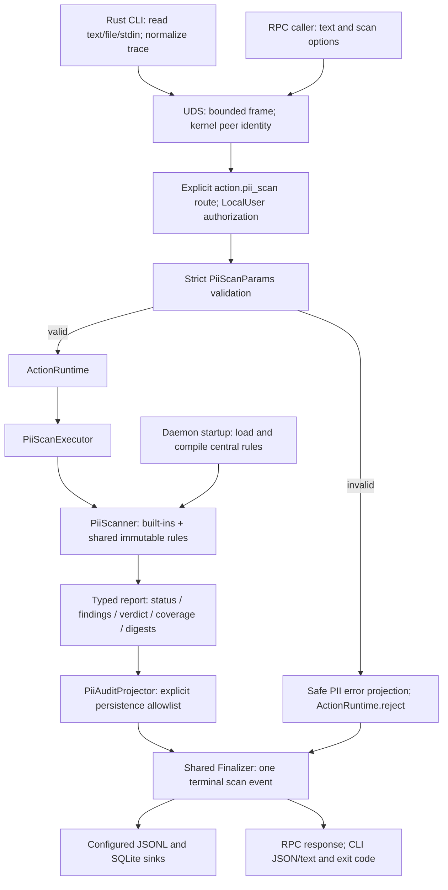
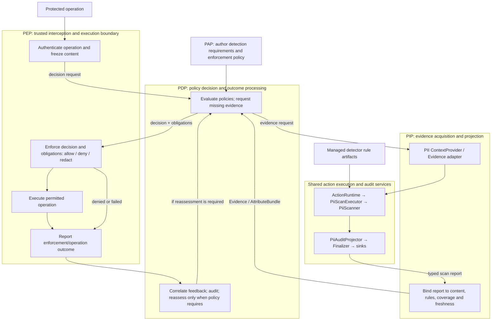

# PII Checker V2: migration and future integration

[中文版](PII_V2_MIGRATION_zh.md)

This design separates the implemented Rust PII migration from future policy-driven
enforcement. The approved delivery consists of five logical commits in one PR:
detector, centralized rules, runtime/audit, RPC/CLI, and acceptance/documentation.
The shared runtime baseline is PR #3246, merged at `60ed5ab17390811de8dfcccade18c4cabed0a6a3`.
The repository [V2 architecture](AGENT_SEC_RUST_MIGRATION_zh.md) remains authoritative.

## Phase 1: implemented execution path

This path does not instantiate PIP, PDP, or PEP. Existing Hook adapters consume the
scan result and apply their existing host-specific behavior. `ActionRuntime` is an
execution/lifecycle service, not a PIP role: it does not obtain policy attributes on
behalf of a PDP, evaluate policies, or control the protected operation.

`asc-capability-pii-scan` owns the transport-free `PiiScanner`, typed request/options,
`PiiRuleSet`, report, executor, and audit projector. `asc-daemon-handler` owns strict
method adaptation; `asc-daemon` composes startup rules and sinks. The Rust CLI only
reads local input and calls the daemon. It cannot fall back to Python or select
server-side files. The core can also be tested directly without daemon or storage.

### Detection and evidence

All 11 V1 built-in types retain validation, confidence adjustment, low-confidence
filtering, type/span deduplication, stable sorting, overlapping findings, merged
redaction, and long-private-key evidence omission. Spans count Unicode characters.
The frozen corpus records Python 3.11.6 outputs and source hashes; 142 synthetic
cases include validators, Unicode boundaries, JWT extensions and negative cases.
Builtin word and decimal classes are frozen to Python 3.11 / Unicode 14; exhaustive
scalar classification and case-folding fixtures protect the V1 boundary semantics.
Elapsed time and additive V2 metadata are excluded from comparisons.

The top-level V1 fields remain `ok`, `verdict`, `summary`, `findings`, `elapsed_ms`,
and optional `redacted_text`. `summary` separates execution status from coverage:

| Coverage | Interpretation |
|----------|----------------|
| `complete` | Received input and configured detectors were fully evaluated |
| `partial` | Input was truncated, custom rules invalid, or matching was limited |
| `unavailable` | Execution failed without usable scan evidence |

Stable reasons include `input_truncated`, `custom_rules_invalid`,
`custom_matching_limited`, `custom_budget_exhausted`, `custom_findings_limited`,
`custom_empty_match`, and `scan_failed`. Verdict aggregates retained findings even
when coverage is partial. Digests identify received and scanned text separately;
neither asserts the identity of content omitted before the request. A future PIP
must bind evidence to the actual protected content and inspect coverage.

### Rule ownership and limits

Built-ins ship with the binary. The daemon loads `/etc/agent-sec/pii-checker/rules.yaml`
or its explicit absolute `--pii-rules` path once and shares `Arc<PiiRuleSet>` across
requests. All callers use the same immutable set; no HOME/owner selection, live
reload, user-directory aggregation, per-request paths, or version-management service
is introduced. Restart applies updates.

Custom YAML retains `type / regex / severity`. The whole custom set becomes invalid
on any schema/compile/read failure; built-ins continue with partial coverage. A
missing default file is `absent`; a missing explicitly selected file is `invalid`.
Bounds remain 256 KiB, 100 rules, 2,048 pattern characters, depth 64, and 100 custom
findings. `fancy-regex` limits backtracking to 1,000,000 steps; a 200 ms loop budget
does not interrupt a single match after 20 ms. Engine depth accounting can reject
64 nested groups. Unsupported Python syntax is rejected without rewriting.
The first omitted finding after 100 stops further custom matching. Earlier findings
remain visible and coverage becomes partial. Counters and budgets are request-local.

### Finalizer, errors, and privacy

The Finalizer owns terminal event submission after execution and projection. Normal,
partial, and failed scans use the same path. After method identification and
authorization, parameter failures call the shared `ActionRuntime.reject` entry with
the PII safe failure projection, then return immediately; they never invoke the
executor. Envelope/method/authorization/transport rejections belong to their own
entry boundaries. One terminal submission is guaranteed during normal lifecycle,
not after crashes or forced termination.

Audit records use an explicit allowlist: digests, lengths, source, rule identity,
coverage, redacted findings, bounded correlation and safe error codes. Raw text,
`raw_evidence`, complete `redacted_text`, regex content, input-derived field spelling,
and arbitrary exception strings are excluded. Scan outcome and sink health are
separate; the existing daemon still requires SQLite warm-up at startup. Runtime
tests exercise JSONL/SQLite failure combinations. Audit persistence is independent
of future tracing sampling/exporters.

### Interface and compatibility classification

| Surface | Phase 1 contract |
|---------|------------------|
| RPC | Only `action.pii_scan`; LocalUser; strict camelCase DTO, unchanged envelope |
| Input | Required `text`; source and scan booleans; optional byte/truncation metadata and `traceContext` |
| CLI | One of `--text`, `--stdin`/`--text-stdin`, `--input`; existing scan flags |
| Limits | No default input truncation; explicit UTF-8-safe prefix; 4 MiB transport frame including serialization overhead |
| Exit | `pass/warn/deny`: 0; scan/connection failure: 1; CLI usage: 2 |
| Identity | UID/GID/PID from UDS peer; trace and `agent_name` never confer authority |
| Trace | Top-level CLI `--trace-context`, V1 aliases/trim/256-character limits; opaque compatibility values, not OTel IDs |
| Rules | Versioned change from V1 per-user/next-scan reload to central/startup load |
| Regex | Explicit unsupported syntax, YAML alias/multiple-document rejection, engine budget/depth differences |
| Runtime | Rust detector/client/daemon; retained V1 is an independent rollback oracle |

The full request schema and executable rejection cases live in `PiiScanParams` and
`tests/v2/e2e/test_pii_cli_e2e.py`. Failed action reports remain inside successful
daemon responses; parameter errors are daemon errors. No generic arbitrary-action
method, PAP detector policy, empty PIP/PDP/PEP scaffold, or cancellation overhaul is added.

## Phase 2: future complete architecture

The following is a target, not implemented phase-1 functionality:

The trusted PEP entry triggers PDP evaluation. PDP calls PIP for information needed
to decide; PIP reuses the phase-1 execution/audit service. The PIP scope covers
acquisition, projection and evidence validity, not all underlying runtime/storage
components. No direct policy-compiler dependency is introduced in the detector.
PEP reports outcomes to PDP, closing the decision/enforcement lifecycle; it does not
re-run the original decision automatically for every result or claim to undo side effects.

PAP should manage policies such as required detectors, permitted data categories,
coverage requirements, and redaction/denial obligations. Regexes, validators, and
confidence heuristics are detector artifacts with a different lifecycle. A future
PAP policy may reference a validated rule profile/version managed by a configuration
service; converting each regex to an authorization policy would mix evidence with
decisions and is not part of this migration.

Future work must define typed Evidence/AttributeBundle projection, protected-content
binding and freshness, behavior for partial/unavailable evidence, actual PDP policy
evaluation, PEP capabilities and obligations, and correlated decision/enforcement
events. Existing opaque V1 correlation must transition to the repository's OTel
contract explicitly. The current report, digests, rule identity and common Finalizer
provide reuse points without pre-implementing those services.

## Acceptance and rollback

| Gate | Executable evidence |
|------|---------------------|
| V1 differential/core | Capability `tests/compatibility.rs`, frozen `v1.json`, validator unit tests |
| Rule isolation/limits | `tests/custom_rules.rs`, rule/custom unit tests |
| Runtime/privacy/sinks | Capability `tests/runtime.rs`, shared runtime and event-sink tests |
| RPC/CLI | `tests/v2/e2e/test_pii_cli_e2e.py`, daemon/CLI protocol tests |
| Shared V1/V2 behavior | `tests/e2e/cli/test_scan_pii_e2e.py`, selected by `PII_E2E_RUNTIME` |
| Six Hook contracts | `tests/v2/e2e/test_pii_hook_contracts.py`; real Rust subprocess, fixed input events |
| Installed RPM | `make test-e2e-rpm-v2`; installed Hook assets, V1 detection source/package hidden |

Hook tests exercise existing Codex, Qoder, Qwen Code, Cosh, Hermes and OpenClaw code.
Only the unmigrated observability record sink is isolated; PII results are never
mocked. No complete Agent host or model is started. CI retains exclusions for
unmigrated mixed-capability suites rather than declaring them migrated wholesale.
Archive the tested commit, commands, environment, artifact hashes and results in
the run evidence; CI output and PR validation identify the actual accepted revision.

Rule rollback restores the previous central YAML and restarts the daemon. Runtime
rollback stops the V2 validation process and restores the V1 package/entrypoint and
its retained rules. V1 detector code and user rules are not modified. This phase
establishes PII core and Hook-contract readiness for a later host switch; it does not
perform that switch, hybrid deployment, full PIP/PDP/PEP integration or generic cancellation work.
