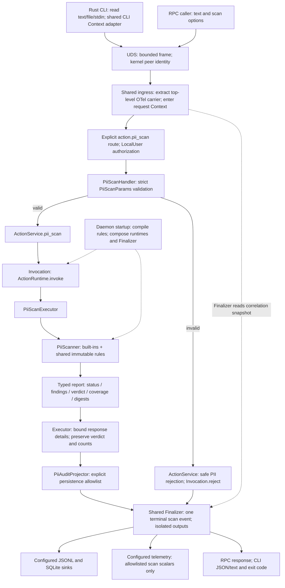
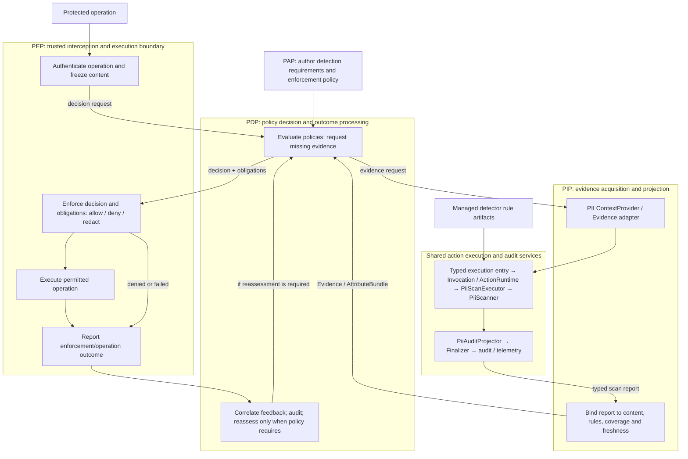

# PII Checker V2: migration and future integration

[中文版](PII_V2_MIGRATION_zh.md)

This design separates the Rust PII migration from future policy-driven
enforcement. The approved delivery consists of five logical commits in one PR:
detector, centralized rules, runtime/audit, RPC/CLI, and acceptance/documentation.
The implementation reuses main's shared lifecycle, flat crate layout and merged OTel Context infrastructure. The phase-1 diagram describes the
implemented execution path; the acceptance section identifies its executable gates.
The repository [V2 architecture](AGENT_SEC_RUST_MIGRATION_zh.md) remains authoritative.

## Phase 1: execution path

This path does not instantiate PIP, PDP, or PEP. Existing Hook adapters consume the
scan result and apply their existing host-specific behavior. `ActionRuntime` is an
execution/lifecycle service, not a PIP role: it does not obtain policy attributes on
behalf of a PDP, evaluate policies, or control the protected operation.

`asc-action-types` owns `PiiScanRequest`, `PiiScanOptions`, and the input-source enum.
`asc-capability-pii-scan` re-exports these contracts and owns the transport-free
`PiiScanner`, `PiiRuleSet`, report, executor, and audit projector. Crates live directly
under `v2/crates/`. `asc-daemon-handler` owns strict method adaptation;
`asc-daemon-core::ActionService` invokes the typed lifecycle port without depending
on a concrete capability. `asc-daemon` composes startup rules, runtimes and output
sinks in `apps/asc-daemon/src/actions.rs` and the process bootstrap. The Rust CLI only
reads local input and calls the daemon. It cannot fall back to Python or select
server-side files. The core can also be tested directly without daemon or storage.

### Detection and evidence

All 11 V1 built-in types retain validation, confidence adjustment, low-confidence
filtering, type/span deduplication, stable sorting, overlapping findings, merged
redaction, and long-private-key evidence omission. Spans count Unicode characters.
The frozen corpus records Python 3.11.6 outputs and source hashes; 142 synthetic
cases include validators, Unicode boundaries, JWT extensions and negative cases.
Builtin word and decimal classes are frozen to Python 3.11 / Unicode 14; exhaustive
scalar classification and case-folding fixtures protect the V1 boundary semantics.
Elapsed time, additive V2 metadata and the explicitly upgraded engine identity are excluded from comparisons.

Detection semantics are versioned as `summary.scanner_version=2.0.0`, included in `ruleset_id`
and successful/failed reports and audit results. Built-in engine identity is `regex_v2`; custom
identity is `fancy_regex`. This version is independent of the package version. Version 2.0.0 fixes
empty-claims JWT detection, retains nonrecursive structural checks for large integers/deep JSON,
normalizes Chinese ID decimal dates/check digits and fullwidth X, and rejects all-zero card
placeholders. The 142 V1 cases continue to check retained behavior; `tests/detection_quality.rs`
adds positives/negatives for all 11 types and the new boundaries without regenerating V1 outputs.
Existing large-input, Unicode, overlapping-redaction, backtracking and finding-limit tests remain.

The top-level V1 fields remain `ok`, `verdict`, `summary`, `findings`, `elapsed_ms`,
and optional `redacted_text`. `summary` separates execution status from coverage:

| Coverage | Interpretation |
|----------|----------------|
| `complete` | Received input and configured detectors were fully evaluated |
| `partial` | Input was truncated, custom rules invalid, or matching was limited |
| `unavailable` | Execution failed without usable scan evidence |

Stable reasons include `input_truncated`, `custom_rules_invalid`,
`custom_matching_limited`, `custom_budget_exhausted`, `custom_findings_limited`,
`custom_empty_match`, and `scan_failed`. Verdict aggregates retained findings even
when coverage is partial. Digests identify received and scanned text separately;
neither asserts the identity of content omitted before the request. A future PIP
must bind evidence to the actual protected content and inspect coverage.

V2 bounds the returned report to 512 KiB of formatted JSON after detection and full-text
redaction finish. Oversize reports retain the first finding of each type/severity and omit raw
evidence. `summary.findings_truncated=true` records reduced findings or evidence. Verdict,
`summary.total`, category/severity
counts, digests and scan coverage still describe all findings detected in the scanned input.
Hook notices use these totals and indicate omitted details. The returned findings are then
representative evidence, not an exhaustive list of locations.

If the full `redacted_text` still exceeds that budget, V2 returns
`[REDACTED: output size limit]` for the entire text and sets
`summary.redacted_text_omitted=true`; it never returns a partly redacted remainder.
Both markers are absent when false. Output reduction alone does not make scan coverage partial,
and completed scans still exit `0`. The transport-free `PiiScanner` retains its full report;
the executor applies this response bound before audit projection and Finalizer.

### Rule ownership and limits

Built-ins ship with the binary. The daemon loads `/etc/agent-sec/pii-checker/rules.yaml`
or its explicit absolute `--pii-rules` path once and shares `Arc<PiiRuleSet>` across
requests. All callers use the same immutable set; no HOME/owner selection, live
reload, user-directory aggregation, per-request paths, or version-management service
is introduced. Restart applies updates.

Custom YAML retains `type / regex / severity`. The whole custom set becomes invalid
on any schema/compile/read failure; built-ins continue with partial coverage. A
missing default file is `absent`; a missing explicitly selected file is `invalid`.
Bounds remain 256 KiB, 100 rules, 2,048 pattern characters, YAML depth 64, and 100 custom
findings. `fancy-regex` allows 1,000,000 backtracks; the 200 ms budget is checked between matching
calls and does not promise to interrupt one call after 20 ms. V2 uses the native dialect directly;
a difference from Python does not produce `invalid_regex`, and administrator patterns are not
rewritten. That code denotes actual parse/compile/engine-limit or load-time evaluation failures.
The group recursion limit includes the root frame: 63 nested groups are accepted, while 64 can
fail; nested character classes have separate engine limits. Positive/negative cases pin V2
newline anchors, Unicode folding, `\h`/`\H`, `\Z`/`\z`, conditionals and set operations.
The first omitted finding after 100 stops further custom matching. Earlier findings
remain visible and coverage becomes partial. Counters and budgets are request-local.

### Finalizer, errors, and privacy

The Finalizer owns terminal event submission after execution and projection. Normal,
partial, and failed scans use the same path. After method identification and
authorization, the PII application rejection method constructs a fixed error code
and an empty request projection, then calls `Invocation.reject`. `ActionRuntime`
implements rejection using the same Finalizer; the handler then returns immediately,
without invoking the
executor. Envelope/method/authorization/transport rejections belong to their own
entry boundaries. One terminal submission is guaranteed during normal lifecycle,
not after crashes or forced termination. The existing runtime catches execution
panics and returns a payload-free `InvokeError` after finalization; the handler maps
it to a controlled internal RPC error. Audit projection and output failures remain
isolated from the scan outcome.

Audit records use an explicit allowlist: digests, lengths, source, rule identity,
coverage, redacted findings, bounded correlation and safe error codes. Raw text,
`raw_evidence`, complete `redacted_text`, regex content, input-derived field spelling,
and arbitrary exception strings are excluded. Scan outcome and sink health are
separate; the existing daemon still requires SQLite warm-up at startup. Runtime
tests exercise JSONL/SQLite failure combinations. Audit persistence is independent
of tracing sampling/exporters.

Telemetry reuses the existing Finalizer output and scalar allowlist. It records
PII verdict and elapsed time alongside existing lifecycle fields, but never input,
findings, redacted text or rule contents. The shared CLI `--trace-context` adapter applies
V1 aliases, trimming and the 256-character limit to one OTel Context. The client propagates
W3C carrier/Agent Baggage through top-level `traceContext`; top-level `compatibility` carries
opaque trace labels. Unpublished `params.traceContext` is removed and rejected as an
unknown parameter; there is no dual input contract.

`Invocation.invoke/reject` explicitly receives only UDS-derived `CallerIdentity`, without
correlation arguments. Before calling any sink, Finalizer snapshots the active Context
once for event session/run/call/tool-call fields, the opaque trace label and the telemetry
Agent-product allowlist. The PII handler projects bounded `agent_name` from the same Context
into the existing request field, preserving safe `details.request.agent_name` audit metadata.
The detector has no OTel dependency. Existing event `trace_id` remains a compatibility label,
not an SDK TraceId or daemon request ID. Both product entrypoints reuse shared initialization
and bounded shutdown; PII adds no second propagation or output pipeline.

### Interface and compatibility classification

| Surface | Phase 1 contract |
|---------|------------------|
| RPC | Only `action.pii_scan`; LocalUser; strict camelCase DTO, unchanged envelope |
| Input | Required `text`; source and scan booleans; optional byte/truncation metadata; no `params.traceContext` |
| CLI | One of `--text`, `--stdin`/`--text-stdin`, `--input`; existing scan flags |
| Limits | No default input truncation; explicit UTF-8-safe prefix; 4 MiB business request plus a separate 32 KiB propagation budget; 4 MiB responses, including serialization and LF overhead |
| Exit | `pass/warn/deny`: 0; scan/connection/shared legacy-trace input failure: 1; ordinary CLI usage: 2 |
| Identity | UID/GID/PID from UDS peer; trace and `agent_name` never confer authority |
| Trace | Top-level CLI `--trace-context`, V1 aliases/trim/256-character limits; shared Context/top-level carrier; opaque labels are not OTel IDs |
| Rules | Versioned change from V1 per-user/next-scan reload to central/startup load |
| Detection version | `scanner_version=2.0.0`; builtin quality changes and native custom syntax have separate cases |
| Regex | Native fancy-regex; actual invalid syntax, YAML alias/multiple-document rejection, execution budgets/engine limits |
| Runtime | Rust detector/client/daemon; retained V1 is an independent rollback oracle |

The full request schema and executable rejection cases live in `PiiScanParams` and
`tests/v2/e2e/test_pii_cli_e2e.py`. Failed action reports remain inside successful
daemon responses; parameter errors and caught unhandled execution failures are
daemon errors. No generic arbitrary-action
method, PAP detector policy, empty PIP/PDP/PEP scaffold, or cancellation overhaul is added.

## Phase 2: future complete architecture

The following is a target, not implemented phase-1 functionality:

The trusted PEP entry triggers PDP evaluation. PDP calls PIP for information needed
to decide; PIP reuses the phase-1 execution/audit service. The PIP scope covers
acquisition, projection and evidence validity, not all underlying runtime/storage
components. No direct policy-compiler dependency is introduced in the detector.
PEP reports outcomes to PDP, closing the decision/enforcement lifecycle; it does not
re-run the original decision automatically for every result or claim to undo side effects.

PAP should manage policies such as required detectors, permitted data categories,
coverage requirements, and redaction/denial obligations. Regexes, validators, and
confidence heuristics are detector artifacts with a different lifecycle. A future
PAP policy may reference a validated rule profile/version managed by a configuration
service; converting each regex to an authorization policy would mix evidence with
decisions and is not part of this migration.

Future work must define typed Evidence/AttributeBundle projection, protected-content
binding and freshness, behavior for partial/unavailable evidence, actual PDP policy
evaluation, PEP capabilities and obligations, and correlated decision/enforcement
events. Future PIP calls reuse the current Context propagation and audit path, carrying
Context across task/thread boundaries through the shared framework, without restoring
private trace parameters. The current report, digests, rule identity and common Finalizer
provide reuse points without pre-implementing those services.

## Acceptance and rollback

This framework adaptation has two validation stages. On macOS, run only formatting,
manifest/lockfile, architecture and standalone Hook mock checks; do not build Linux-only
components. These checks do not establish Rust compilation, real UDS, Rust Hook subprocess
or installed-RPM acceptance. Once the test machine is available, run the Linux gates below
against the final revision and compile each of the five logical commits at its stage.
A local pass means "adaptation developed; minimum local checks passed; Linux runtime and
RPM acceptance pending." Do not reuse pre-adaptation passes or automatically mark Ready/merge.

| Gate | Executable evidence |
|------|---------------------|
| V1 differential/core | Capability `tests/compatibility.rs`, frozen `v1.json`, validator unit tests |
| Rule isolation/limits | `tests/custom_rules.rs`, rule/custom unit tests |
| Runtime/privacy/sinks | Capability `tests/runtime.rs`, shared runtime and event-sink tests |
| Framework boundaries | `tests/v2/test_action_architecture.py`; typed invocation/rejection and isolated telemetry tests |
| RPC/CLI | `tests/v2/e2e/test_pii_cli_e2e.py`, daemon/CLI protocol tests |
| Shared V1/V2 behavior | `tests/e2e/cli/test_scan_pii_e2e.py`, selected by `PII_E2E_RUNTIME` |
| Six Hook contracts | `tests/v2/e2e/test_pii_hook_contracts.py`; real Rust subprocess, fixed input events |
| Installed RPM | `make test-e2e-rpm-v2`; installed Hook assets, V1 detection source/package hidden |

Hook tests exercise existing Codex, Qoder, Qwen Code, Cosh, Hermes and OpenClaw code.
Only the unmigrated observability record sink is isolated; PII results are never
mocked. No complete Agent host or model is started. CI retains exclusions for
unmigrated mixed-capability suites rather than declaring them migrated wholesale.
Archive the tested commit, commands, environment, artifact hashes and results in
the run evidence. The PR body records developer-run checks and pending gates only; GitHub checks display CI status.

Deploy the carrier-capable daemon before the CLI. For an OTel-only rollback, reverse
that order: roll back callers before the daemon; never strip the carrier and retry.

Rule rollback restores the previous central YAML and restarts the daemon. Runtime
rollback stops the V2 validation process and restores the V1 package/entrypoint and
its retained rules. V1 detector code and user rules are not modified. This phase
establishes PII core and Hook-contract readiness for a later host switch; it does not
perform that switch, hybrid deployment, full PIP/PDP/PEP integration or generic cancellation work.
