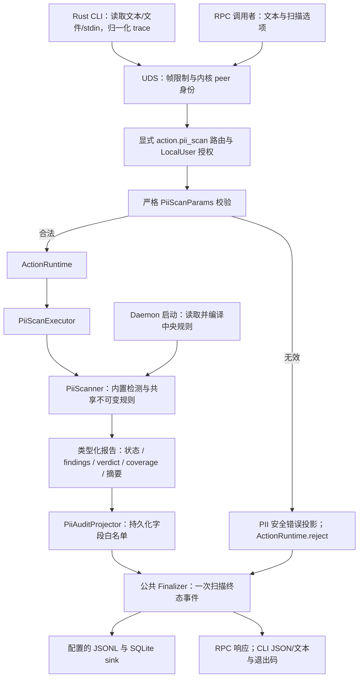
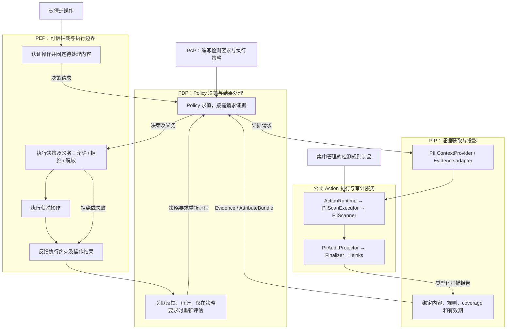

# PII Checker V2：迁移与未来接入设计

[English](PII_V2_MIGRATION.md)

本文区分已经实现的 Rust PII 迁移与未来基于 Policy 的完整控制链路。批准的交付由一个 PR 中
五个逻辑 commit 组成：检测核心、集中规则、Runtime/审计、RPC/CLI、验收与文档。
公共 Runtime 基础为 PR #3246，已合并到 `60ed5ab17390811de8dfcccade18c4cabed0a6a3`。
仓库 [V2 总体架构](AGENT_SEC_RUST_MIGRATION_zh.md) 仍是架构权威来源。

## 第一阶段：当前执行链路

该链路尚未实例化 PIP、PDP 或 PEP。现有 Hook adapter 消费扫描结果并维持宿主已有行为。
`ActionRuntime` 是执行和生命周期服务，不是 PIP 角色：它不代表 PDP 获取决策属性，不执行
Policy 求值，也不控制被保护的操作。

`asc-capability-pii-scan` 提供不依赖传输的 `PiiScanner`、类型化请求/选项、`PiiRuleSet`、
报告、Executor 和 AuditProjector。`asc-daemon-handler` 负责严格方法适配；`asc-daemon`
组装启动规则与 sink。Rust CLI 只读取本地输入并调用 daemon，不回退到 Python，也不能选择
服务端文件。检测核心可以脱离 daemon 和存储独立测试。

### 检测与证据

11 类 V1 内置检测保留格式校验、置信度调整、低置信度过滤、类型与位置去重、稳定排序、
重叠发现、合并区间脱敏，以及长私钥证据省略行为。span 使用 Unicode 字符位置。
冻结语料记录 Python 3.11.6 输出和源文件摘要；142 个合成用例覆盖校验器、Unicode 边界、
JWT 扩展与反例。差分只排除耗时和 V2 新增元数据。
内置 word 和 decimal 字符表固定为 Python 3.11 / Unicode 14；全量 Unicode scalar
分类检查和大小写匹配用例保护 V1 的字符边界语义。

V1 顶层字段仍为 `ok`、`verdict`、`summary`、`findings`、`elapsed_ms` 和可选
`redacted_text`。`summary` 将执行状态与覆盖状态分开：

| Coverage | 含义 |
|----------|------|
| `complete` | 收到的输入和配置的检测器均完成评估 |
| `partial` | 输入被截断、自定义规则无效或匹配受限 |
| `unavailable` | 执行失败，无法提供可用扫描证据 |

原因码包括 `input_truncated`、`custom_rules_invalid`、`custom_matching_limited`、
`custom_budget_exhausted`、`custom_findings_limited`、`custom_empty_match` 和 `scan_failed`。
即使覆盖不完整，verdict 仍只聚合保留的 findings。分别记录收到文本与实际扫描文本的摘要，
都不声称代表请求前已省略的内容。未来 PIP 必须绑定实际受保护内容并检查 coverage。

### 规则归属与限制

内置规则随二进制发布。daemon 在启动时读取默认 `/etc/agent-sec/pii-checker/rules.yaml`
或显式绝对路径 `--pii-rules`，编译后以 `Arc<PiiRuleSet>` 共享。所有调用者使用同一份不可变
规则集合；不按 HOME/owner 选择，不热更新，不汇总用户目录，不接受请求级规则路径，也不建设
版本管理服务。重启后应用更新。

自定义 YAML 保留 `type / regex / severity`。任一 schema、编译或读取失败会使整份自定义集合
无效；内置检测继续执行，覆盖状态为 partial。默认文件缺失为 `absent`，显式文件缺失为 `invalid`。
上限为 256 KiB、100 条规则、2,048 字符模式、64 层深度和 100 条自定义发现。
`fancy-regex` 回溯上限为 1,000,000，200 ms 扫描循环预算不保证单次匹配在 20 ms 内中断。
引擎深度计数可能拒绝 64 层嵌套分组。不支持的 Python 语法直接拒绝，不改写规则。
超过 100 条后首次省略有效 finding 时停止剩余自定义匹配，保留此前结果并标记 partial。
计数器和预算均为请求级状态。

### Finalizer、错误与隐私

Finalizer 在执行及投影后负责提交扫描终态事件。正常、部分完成与失败扫描进入同一路径。
方法已经识别且授权通过后的参数错误，通过公共 `ActionRuntime.reject` 提交 PII 安全错误投影，
随后直接返回，不执行 Executor。无效信封、未知方法、授权或传输失败由相应入口处理。
正常生命周期内只提交一次终态事件；不保证崩溃或强制终止后的 exactly-once。

审计采用显式白名单：摘要、长度、source、规则标识、coverage、脱敏 findings、有界关联字段和
安全错误码。原文、`raw_evidence`、完整 `redacted_text`、正则内容、输入中的原始字段拼写和
任意异常字符串不得直接持久化。扫描结果与 sink 健康分开；现有 daemon 启动仍要求 SQLite
预热成功。Runtime 测试分别覆盖 JSONL/SQLite 失败组合。审计持久化不依赖未来 tracing 采样或 exporter。

### 接口与兼容性分类

| 接口 | 第一阶段契约 |
|------|--------------|
| RPC | 仅 `action.pii_scan`；LocalUser；严格 camelCase DTO，不修改信封 |
| 输入 | 必填 `text`；source 与扫描布尔选项；可选字节/截断元数据及 `traceContext` |
| CLI | `--text`、`--stdin`/`--text-stdin`、`--input` 恰选其一，保留扫描选项 |
| 限制 | 不默认截断；显式 UTF-8 安全前缀；4 MiB 帧上限包含序列化开销 |
| 退出码 | `pass/warn/deny` 为 0；扫描或连接失败为 1；CLI 用法错误为 2 |
| 身份 | UID/GID/PID 来自 UDS peer；trace 和 `agent_name` 不授予权限 |
| Trace | CLI 顶层 `--trace-context`；V1 别名、去空白和 256 字符限制；透明兼容值，不是 OTel ID |
| 规则 | 从 V1 用户级、下次扫描加载，显式迁移为中央配置、启动加载 |
| 正则 | 明确不支持语法、YAML 别名/多文档拒绝，以及引擎预算/深度差异 |
| Runtime | 检测器、client、daemon 均为 Rust；保留 V1 作为独立回滚及 oracle |

完整请求 schema 和可执行拒绝用例位于 `PiiScanParams` 与
`tests/v2/e2e/test_pii_cli_e2e.py`。扫描执行失败报告仍处于成功的 daemon 响应内；
参数错误是 daemon error。本次不引入通用任意 action 方法、PAP 检测 Policy、空的
PIP/PDP/PEP 实现或执行取消框架改造。

## 第二阶段：未来完整架构

下图为目标设计，不属于第一阶段已实现能力：

可信 PEP 入口触发 PDP；PDP 按决策需要调用 PIP；PIP 复用第一阶段执行及审计服务。
PIP 范围包括获取、投影及证据有效性判断，不把底层 Runtime/存储全部归入 PIP。
检测器不直接依赖 Policy Compiler。PEP 将结果反馈给 PDP，形成决策与执行闭环；
不会对每次结果自动重复原决策，也不声称撤销既有外部副作用。

PAP 适合管理需要哪些检测、允许哪些数据类别、完整性要求、脱敏或拒绝义务等 Policy。
正则、校验器、置信度启发式属于生命周期不同的检测制品。未来 PAP Policy 可以引用配置服务
管理且已校验的规则 profile/version；将每条正则直接转成授权 Policy 会混淆证据与决策，
不属于本次迁移。

未来需明确类型化 Evidence/AttributeBundle 投影、受保护内容绑定与有效期、partial/unavailable
证据的处理、实际 PDP 求值、PEP 能力及义务，以及关联的决策/执行事件。
现有透明 V1 关联字段必须显式迁移到仓库 OTel 契约。当前类型化报告、摘要、规则标识和公共
Finalizer 是复用点，不预先实现这些未来服务。

## 验收与回滚

| 门禁 | 可执行证据 |
|------|------------|
| V1 差分与核心 | capability `tests/compatibility.rs`、冻结 `v1.json`、校验器单测 |
| 规则隔离与限制 | `tests/custom_rules.rs`、rules/custom 单测 |
| Runtime/隐私/sink | capability `tests/runtime.rs`、公共 runtime/event-sink 测试 |
| RPC/CLI | `tests/v2/e2e/test_pii_cli_e2e.py`、daemon/CLI 协议测试 |
| V1/V2 共同行为 | `tests/e2e/cli/test_scan_pii_e2e.py`，使用 `PII_E2E_RUNTIME` 选择 |
| 六种 Hook 契约 | `tests/v2/e2e/test_pii_hook_contracts.py`；固定事件与真实 Rust 子进程 |
| RPM 安装态 | `make test-e2e-rpm-v2`；安装后的 Hook，屏蔽 V1 检测源码/包 |

Hook 测试执行现有 Codex、Qoder、Qwen Code、Cosh、Hermes 和 OpenClaw 代码，仅隔离未迁移的
observability record 存储；PII 结果不 mock。不启动完整 Agent 宿主或模型。CI 保留含未迁移能力的
混合测试组排除项，不把整组直接声明为已迁移。测试提交、命令、环境、制品摘要与结果归档在
本次运行证据中；CI 输出和 PR 验收说明标识实际通过版本。

规则回滚恢复上一份中央 YAML 并重启 daemon。Runtime 回滚停止 V2 验证进程，恢复 V1 包/入口
及保留的规则。V1 检测代码和用户规则不被修改。本阶段建立 PII 核心及 Hook 契约的后续切换条件，
不执行真实宿主切换、混合部署、完整 PIP/PDP/PEP 接入或通用取消框架改造。
