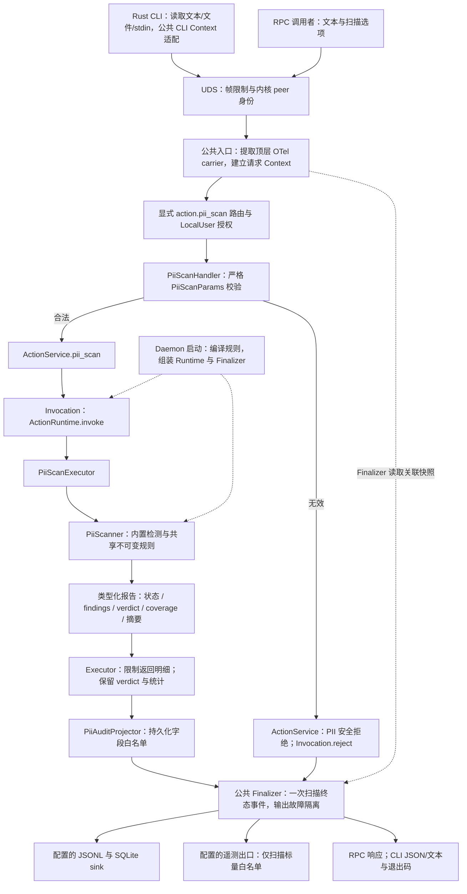
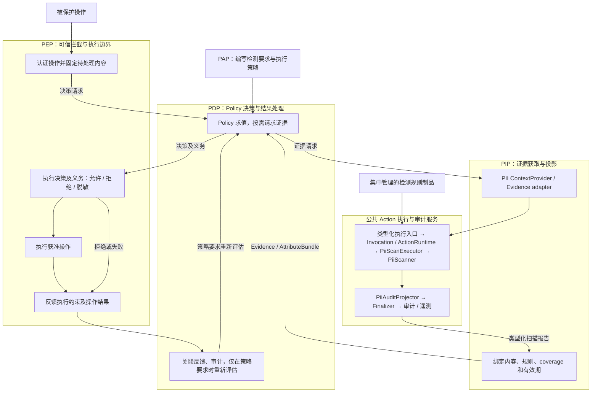

# PII Checker V2：迁移与未来接入设计

[English](PII_V2_MIGRATION.md)

本文区分 Rust PII 迁移与未来基于 Policy 的完整控制链路。批准的交付由一个 PR 中
五个逻辑 commit 组成：检测核心、集中规则、Runtime/审计、RPC/CLI、验收与文档。
实现复用 main 的公共生命周期、扁平化 crate 结构和已合入的 OTel Context 基础设施。
下文第一阶段流程图描述已实现的执行路径；验收章节列出对应的可执行门禁。
仓库 [V2 总体架构](AGENT_SEC_RUST_MIGRATION_zh.md) 仍是架构权威来源。

## 第一阶段：执行链路

该链路尚未实例化 PIP、PDP 或 PEP。现有 Hook adapter 消费扫描结果并维持宿主已有行为。
`ActionRuntime` 是执行和生命周期服务，不是 PIP 角色：它不代表 PDP 获取决策属性，不执行
Policy 求值，也不控制被保护的操作。

`asc-action-types` 定义 `PiiScanRequest`、`PiiScanOptions` 和输入来源枚举。
`asc-capability-pii-scan` 重新导出这些契约，提供不依赖传输的 `PiiScanner`、`PiiRuleSet`、
报告、Executor 和 AuditProjector。各 crate 直接位于 `v2/crates/`。
`asc-daemon-handler` 负责严格方法适配；`asc-daemon-core::ActionService` 调用类型化生命周期
接口，不依赖具体 capability。`asc-daemon` 在 `apps/asc-daemon/src/actions.rs` 及进程启动逻辑中
组装规则、Runtime 和输出 sink。Rust CLI 只读取本地输入并调用 daemon，不回退到 Python，也不能选择
服务端文件。检测核心可以脱离 daemon 和存储独立测试。

### 检测与证据

11 类 V1 内置检测保留格式校验、置信度调整、低置信度过滤、类型与位置去重、稳定排序、
重叠发现、合并区间脱敏，以及长私钥证据省略行为。span 使用 Unicode 字符位置。
冻结语料记录 Python 3.11.6 输出和源文件摘要；142 个合成用例覆盖校验器、Unicode 边界、
JWT 扩展与反例。差分只排除耗时、V2 新增元数据及明确升级的 engine 标识。
内置 word 和 decimal 字符表固定为 Python 3.11 / Unicode 14；全量 Unicode scalar
分类检查和大小写匹配用例保护 V1 的字符边界语义。

检测语义版本为 `summary.scanner_version=2.0.0`，纳入 `ruleset_id`，并在成功/失败扫描及
审计结果中记录。内置 engine 为 `regex_v2`，自定义 engine 为 `fancy_regex`。该版本独立于包版本。
2.0.0 修复空 claims JWT 漏报，保留大整数/深层 JSON 的非递归结构检查；身份证日期和校验位
统一转换数字并支持全角 X；银行卡排除全零占位符。142 个 V1 用例继续验证不变行为，
`tests/detection_quality.rs` 的 11 类正反例及新增边界定义这些变化，不重生成 V1 预期。
既有大输入、Unicode、重叠脱敏、回溯及发现数量限制测试继续约束效果和执行成本。

V1 顶层字段仍为 `ok`、`verdict`、`summary`、`findings`、`elapsed_ms` 和可选
`redacted_text`。`summary` 将执行状态与覆盖状态分开：

| Coverage | 含义 |
|----------|------|
| `complete` | 收到的输入和配置的检测器均完成评估 |
| `partial` | 输入被截断、自定义规则无效或匹配受限 |
| `unavailable` | 执行失败，无法提供可用扫描证据 |

原因码包括 `input_truncated`、`custom_rules_invalid`、`custom_matching_limited`、
`custom_budget_exhausted`、`custom_findings_limited`、`custom_empty_match` 和 `scan_failed`。
即使覆盖不完整，verdict 仍只聚合保留的 findings。分别记录收到文本与实际扫描文本的摘要，
都不声称代表请求前已省略的内容。未来 PIP 必须绑定实际受保护内容并检查 coverage。

V2 在完成检测和全文脱敏后，将返回报告限制在 512 KiB 的格式化 JSON 内。超限报告仅保留每种
类型/严重级别的首条 finding，省略原始证据；若明细或证据发生缩减，设置
`summary.findings_truncated=true`。
verdict、`summary.total`、类别/严重级别统计、摘要和扫描 coverage 仍代表扫描范围内全部已检测
结果。Hook 提示使用这些总数并说明明细已省略；此时返回的 findings 是代表性证据，不是完整位置列表。

若完整 `redacted_text` 仍使报告超限，V2 用 `[REDACTED: output size limit]` 替代整段文本，
并设置 `summary.redacted_text_omitted=true`，不会返回未完成脱敏的尾部。两个标记在 false 时省略。
仅缩减输出不会使扫描 coverage 变成 partial；已完成扫描仍退出 `0`。独立的 `PiiScanner` 保留
完整报告；Executor 在审计投影和 Finalizer 之前执行返回限制。

### 规则归属与限制

内置规则随二进制发布。daemon 在启动时读取默认 `/etc/agent-sec/pii-checker/rules.yaml`
或显式绝对路径 `--pii-rules`，编译后以 `Arc<PiiRuleSet>` 共享。所有调用者使用同一份不可变
规则集合；不按 HOME/owner 选择，不热更新，不汇总用户目录，不接受请求级规则路径，也不建设
版本管理服务。重启后应用更新。

自定义 YAML 保留 `type / regex / severity`。任一 schema、编译或读取失败会使整份自定义集合
无效；内置检测继续执行，覆盖状态为 partial。默认文件缺失为 `absent`，显式文件缺失为 `invalid`。
上限为 256 KiB、100 条规则、2,048 字符模式、64 层 YAML 深度和 100 条自定义发现。
`fancy-regex` 回溯上限为 1,000,000；200 ms 是匹配调用之间的预算，不保证 20 ms 中断单次匹配。
V2 使用引擎原生方言，不因与 Python 行为不同而返回 `invalid_regex`，不自动改写管理员规则。
`invalid_regex` 仅用于实际解析/编译/引擎限制或加载求值失败；引擎分组递归限制包含根帧，
63 层分组可接受，64 层可能失败，嵌套字符类使用独立的引擎限制。正反例固定末尾换行、
Unicode 大小写折叠、`\h`/`\H`、`\Z`/`\z`、条件分支和集合运算的 V2 语义。
超过 100 条后首次省略有效 finding 时停止剩余自定义匹配，保留此前结果并标记 partial。
计数器和预算均为请求级状态。

### Finalizer、错误与隐私

Finalizer 在执行及投影后负责提交扫描终态事件。正常、部分完成与失败扫描进入同一路径。
方法已经识别且授权通过后的参数错误，由 PII 应用入口构造固定错误码及空请求投影，调用
`Invocation.reject`。`ActionRuntime` 使用同一个 Finalizer 收尾，Handler 随后直接返回，不执行
Executor。无效信封、未知方法、授权或传输失败由相应入口处理。
正常生命周期内只提交一次终态事件；不保证崩溃或强制终止后的 exactly-once。沿用 Runtime 对
执行 panic 的捕获：收尾后返回不含原始异常的 `InvokeError`，由 Handler 转为安全的内部 RPC 错误。
审计投影和输出故障与扫描结果隔离。

审计采用显式白名单：摘要、长度、source、规则标识、coverage、脱敏 findings、有界关联字段和
安全错误码。原文、`raw_evidence`、完整 `redacted_text`、正则内容、输入中的原始字段拼写和
任意异常字符串不得直接持久化。扫描结果与 sink 健康分开；现有 daemon 启动仍要求 SQLite
预热成功。Runtime 测试分别覆盖 JSONL/SQLite 失败组合。审计持久化不依赖 tracing 采样或 exporter。

遥测复用 Finalizer 的现有出口和标量白名单，在已有生命周期字段之外记录 PII verdict 与耗时，
不记录原文、findings、完整脱敏文本或规则内容。CLI 复用公共 `--trace-context` 适配，将 V1
别名、去空白和 256 字符限制应用到统一 OTel Context；client 使用顶层 `traceContext` 传播
W3C carrier/Agent Baggage，顶层 `compatibility` 保存 opaque trace 标签。未发布的
`params.traceContext` 被移除，作为未知参数拒绝；不保留双入口。

`Invocation.invoke/reject` 只显式接收来自 UDS peer 的 `CallerIdentity`，不传递 correlation。
Finalizer 在写入任何 sink 前读取一次当前 Context，为事件补齐 session/run/call/tool-call 与
opaque 兼容 trace 标签，并为遥测提供白名单 Agent product。PII Handler 从同一 Context 提取
有界 `agent_name` 放入既有请求字段，保留 `details.request.agent_name` 的安全投影；检测器
不依赖 OTel。既有事件 `trace_id` 仍是兼容标签，不替换为 SDK TraceId 或 daemon request ID。
两个产品入口复用公共初始化和有界关闭；PII 不建立第二套传播或输出流程。

### 接口与兼容性分类

| 接口 | 第一阶段契约 |
|------|--------------|
| RPC | 仅 `action.pii_scan`；LocalUser；严格 camelCase DTO，不修改信封 |
| 输入 | 必填 `text`；source 与扫描布尔选项；可选字节/截断元数据；不接受 `params.traceContext` |
| CLI | `--text`、`--stdin`/`--text-stdin`、`--input` 恰选其一，保留扫描选项 |
| 限制 | 不默认截断；显式 UTF-8 安全前缀；请求业务 4 MiB、传播成员另有 32 KiB；响应仍为 4 MiB，包含序列化与 LF 开销 |
| 退出码 | `pass/warn/deny` 为 0；扫描、连接或公共 legacy trace 输入错误为 1；普通 CLI 用法错误为 2 |
| 身份 | UID/GID/PID 来自 UDS peer；trace 和 `agent_name` 不授予权限 |
| Trace | CLI 顶层 `--trace-context`；V1 别名、去空白和 256 字符限制；复用公共 Context/顶层 carrier，opaque 标签不是 OTel ID |
| 规则 | 从 V1 用户级、下次扫描加载，显式迁移为中央配置、启动加载 |
| 检测版本 | `scanner_version=2.0.0`；内置质量改进与原生自定义方言有独立用例 |
| 正则 | 原生 fancy-regex；实际无效语法、YAML 别名/多文档拒绝，以及执行预算/引擎限制 |
| Runtime | 检测器、client、daemon 均为 Rust；保留 V1 作为独立回滚及 oracle |

完整请求 schema 和可执行拒绝用例位于 `PiiScanParams` 与
`tests/v2/e2e/test_pii_cli_e2e.py`。扫描执行失败报告仍处于成功的 daemon 响应内；
参数错误和已捕获的未处理执行异常是 daemon error。本次不引入通用任意 action 方法、PAP 检测 Policy、空的
PIP/PDP/PEP 实现或执行取消框架改造。

## 第二阶段：未来完整架构

下图为目标设计，不属于第一阶段已实现能力：

可信 PEP 入口触发 PDP；PDP 按决策需要调用 PIP；PIP 复用第一阶段执行及审计服务。
PIP 范围包括获取、投影及证据有效性判断，不把底层 Runtime/存储全部归入 PIP。
检测器不直接依赖 Policy Compiler。PEP 将结果反馈给 PDP，形成决策与执行闭环；
不会对每次结果自动重复原决策，也不声称撤销既有外部副作用。

PAP 适合管理需要哪些检测、允许哪些数据类别、完整性要求、脱敏或拒绝义务等 Policy。
正则、校验器、置信度启发式属于生命周期不同的检测制品。未来 PAP Policy 可以引用配置服务
管理且已校验的规则 profile/version；将每条正则直接转成授权 Policy 会混淆证据与决策，
不属于本次迁移。

未来需明确类型化 Evidence/AttributeBundle 投影、受保护内容绑定与有效期、partial/unavailable
证据的处理、实际 PDP 求值、PEP 能力及义务，以及关联的决策/执行事件。
未来 PIP 调用继续复用当前 Context 传播及审计链路；跨线程或任务边界按公共框架传递 Context，
不恢复私有 trace 参数。当前类型化报告、摘要、规则标识和公共 Finalizer 是复用点，
不预先实现这些未来服务。

## 验收与回滚

本次框架适配分两步验证：macOS 仅执行格式、清单/锁文件、架构约束及独立 Hook mock 自检；
不构建 Linux 专用组件。这些检查不证明 Rust 编译、真实 UDS、Hook Rust 子进程或 RPM 安装态通过。
测试机恢复后，在最终提交上完成下列 Linux 运行门禁及五个提交的逐阶段编译检查。
自检通过时状态为“适配开发完成，本机最小自检通过，Linux 运行与 RPM 验收待完成”；
不能沿用适配前提交的通过结果，也不自动转 Ready 或合入。

| 门禁 | 可执行证据 |
|------|------------|
| V1 差分与核心 | capability `tests/compatibility.rs`、冻结 `v1.json`、校验器单测 |
| 规则隔离与限制 | `tests/custom_rules.rs`、rules/custom 单测 |
| Runtime/隐私/sink | capability `tests/runtime.rs`、公共 runtime/event-sink 测试 |
| 框架边界 | `tests/v2/test_action_architecture.py`；类型化调用/拒绝及遥测隔离测试 |
| RPC/CLI | `tests/v2/e2e/test_pii_cli_e2e.py`、daemon/CLI 协议测试 |
| V1/V2 共同行为 | `tests/e2e/cli/test_scan_pii_e2e.py`，使用 `PII_E2E_RUNTIME` 选择 |
| 六种 Hook 契约 | `tests/v2/e2e/test_pii_hook_contracts.py`；固定事件与真实 Rust 子进程 |
| RPM 安装态 | `make test-e2e-rpm-v2`；安装后的 Hook，屏蔽 V1 检测源码/包 |

Hook 测试执行现有 Codex、Qoder、Qwen Code、Cosh、Hermes 和 OpenClaw 代码，仅隔离未迁移的
observability record 存储；PII 结果不 mock。不启动完整 Agent 宿主或模型。CI 保留含未迁移能力的
混合测试组排除项，不把整组直接声明为已迁移。测试提交、命令、环境、制品摘要与结果归档在
本次运行证据中。PR 描述只记录实际开发者测试及待验收项，CI 状态由 GitHub 检查展示。

部署时先更新支持顶层 carrier 的 daemon，再更新 CLI；仅回滚 OTel 接入时按相反顺序，
先回滚 caller，再回滚 daemon，不自动去掉 carrier 重试。

规则回滚恢复上一份中央 YAML 并重启 daemon。Runtime 回滚停止 V2 验证进程，恢复 V1 包/入口
及保留的规则。V1 检测代码和用户规则不被修改。本阶段建立 PII 核心及 Hook 契约的后续切换条件，
不执行真实宿主切换、混合部署、完整 PIP/PDP/PEP 接入或通用取消框架改造。
