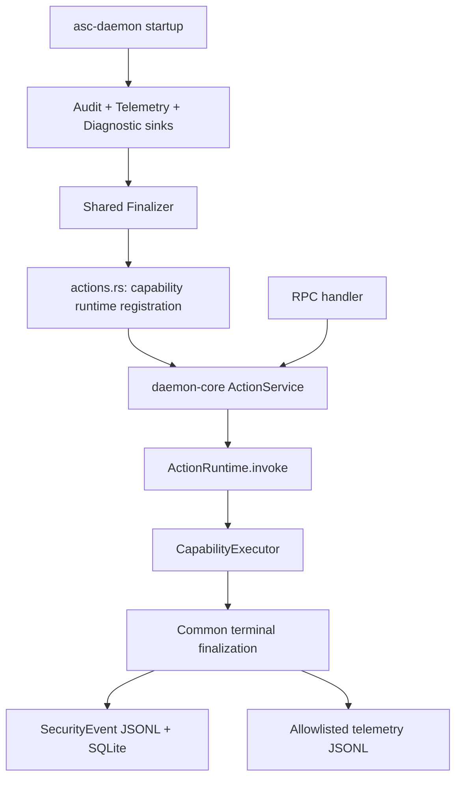

# AgentSec V2 Action Runtime 执行与可观测性架构提案

| 属性 | 值 |
| --- | --- |
| 状态 | 整体为 **[PROPOSAL]**；§5.4、§7.4.1、§13.1–13.2 记录已实现的共享基础设施切片，其余目标不因此自动完成 |
| 设计日期 | 2026-08-21 |
| 目标 tracing 决策日期 | 2026-08-25 |
| 原提案核对提交 | `fe58ed4b23b8` |
| 共享基础设施实现基线 | `d940a663066499d875f951d37b8da5df3e3cd9ea`，2026-09-16 工作区验收见 §13.1 |
| 适用范围 | V1 middleware 行为到 V2 asc-action-runtime/CapabilityExecutor 的迁移，以及 SecurityEvent、诊断日志、trace 和 telemetry |

## 1. 结论

V2 产品架构和迁移边界以仓库内迁移总计划为准；权威关系见
[`AGENT_SEC_RUST_MIGRATION_zh.md`](AGENT_SEC_RUST_MIGRATION_zh.md#1-文档状态与仓库内权威关系)。
Rust 实现不应
逐个翻译当前 Python 的 `router -> pre_action -> backend.execute -> post_action/on_error`
结构，而应把可保留的外部行为映射为：

```text
transport / binding adapter
  -> CoreIngress(ActionId + bounded raw params)
       -> action decoder + typed validation
  -> ActionRuntime
       -> ActionRegistry / ActionSpec
       -> InvocationSupervisor
       -> typed validation
       -> admission + execution resource
       -> typed CapabilityExecutor
       -> InvocationFinalizer
            -> SecurityEvent projector + sink
            -> telemetry projector + sink
            -> tracing span / diagnostic event
  -> compatibility projection
       -> domain ActionResult / daemon V1 compatibility response
```

核心变化不是把 Python hook 换成 Rust trait，而是建立一个显式、可测试的 invocation 状态机，
再从同一份 finalized invocation 派生安全审计、诊断日志和 telemetry。三种输出共享生命周期
事实，但不共享一个无限扩张的通用 payload。

目标 tracing 架构采用 OpenTelemetry 作为技术 trace identity 和 context propagation 的唯一
权威来源。AgentSec 不再维护第二套自定义 trace ID；它只定义 Agent/security 领域的 span
边界、语义 attributes、status/event/link 规则以及到 SecurityEvent 和日志的安全投影。该
目标是版本化的 **[TARGET V2]**，不改写当前 Python/V1 oracle。

## 2. 当前实现中需要保留的语义

以下内容是产品行为，不依赖 Python，Rust 必须保持：

1. 所有 capability 经过一个逻辑 `invoke(action, context, params)` 入口。
2. action 是静态 allowlist；未知 action 在 backend 执行前失败。
3. `ActionResult.success`、security verdict 和 daemon transport `ok` 是不同层次。
4. 每次已路由 invocation 最多产生一条最终 SecurityEvent；正常完成和异常二选一。
5. SecurityEvent 和 telemetry 写入失败不改变 backend 的业务结果。
6. V1 兼容验收期间，`trace_id/session_id/run_id/call_id/tool_call_id` 在 adapter、core、
   event 间保持当前语义；V2 对 trace identity 的替换按第 7.3 节执行。
7. PII、Skill Ledger 等 action 的 audit sanitizer 属于产品契约。
8. daemon、Job 和其它正式入口调用同一个 lifecycle owner，不能重复写 event。
9. V1 oracle 继续用六字段 `ActionResult` 做差分；daemon V1 compatibility adapter 继续
   使用四字段投影。Python/PyO3 不进入 V2 runtime。

权威语义仍由
[`SECURITY_MIDDLEWARE_CONTRACT_zh.md`](SECURITY_MIDDLEWARE_CONTRACT_zh.md) 和
[`SECURITY_ACTIONS_REFERENCE_zh.md`](SECURITY_ACTIONS_REFERENCE_zh.md) 定义。本文只提出 Rust
承接结构；本文中的类型名、module 和 crate 划分不是 wire contract。

## 3. 当前 Python 结构不应照搬的部分

### 3.1 hook 只有形式，没有可组合 middleware 语义

当前 `pre_action` 是 no-op；`post_action` 和 `on_error` 实际是两个 finalizer 分支。把它们
照搬为一组 Rust hook 会保留下列问题：

- hook 的调用顺序依靠 orchestration 代码约定；
- future 被取消、task panic 或 blocking work 脱离调用方等待时，final hook 容易漏执行；
- hook 可以接触原始 params 和 result，扩大敏感数据暴露面；
- lifecycle 失败被多层 `except/pass` 吞掉，没有统一的降级状态或 health 计数。

Rust core 应使用一个显式 `InvocationFinalizer`，所有终态都通过同一入口完成。

### 3.2 默认复制全部 params 是不安全的扩展默认值

当前 `BaseBackend.build_event_details()` 默认深拷贝全部 kwargs 和 result。它导致新增 backend
参数时，即使开发者没有做 audit 设计，新字段也会自动进入 JSONL 和 SQLite。当前 PII 和
Skill Ledger 通过特例修补该问题，但其它 action 仍可能保存 code、prompt、command、path
或原始 error。

Rust 中不得提供“自动序列化整个 request”作为默认 audit 实现。每个 action 必须显式实现
版本化 audit projector。为了保持 V1 兼容，初始 projector 可以明确枚举当前已经持久化的
字段；以后新增 request 字段默认不进入 event。进一步删除当前 V1 原始字段属于独立的产品
和数据迁移决策，不能在语言迁移中静默完成。

### 3.3 ambient context 和 process singleton 不适合长期 daemon

当前 Python 同时使用 process-level trace context、`ContextVar` request override、懒加载
backend singleton、JSONL singleton 和 SQLite singleton。这能支撑同步 CLI，但在长生命周期、
多请求并发和 blocking thread 之间容易产生隐式依赖。

Rust core 应显式接收 `ExecutionContext`，并通过构造参数注入 registry、clock、ID generator、
event sink、telemetry sink 和 execution resources。除进程级 subscriber 等基础设施外，业务
逻辑不读取线程局部或全局 mutable state。

### 3.4 当前 trace 实际是 correlation，不是完整 tracing

当前 `trace_id` 等字段是长度受限的 opaque correlation string；实现没有 span、span ID、
parent/link 或标准 distributed trace carrier。Rust 迁移不能仅把这些字段写进 log 后就宣称
完成 tracing。

**[PRESERVE V1]** 等价迁移和 V1 fixture 必须继续把现有 `trace_id` 当作 opaque
correlation string；不得把任意 caller 值强行解析成 OpenTelemetry TraceId。

**[TARGET V2]** 完成版本化切换后，技术 trace identity 只来自 OpenTelemetry
`SpanContext`。V2 ingress 只传播 W3C `traceparent/tracestate`，不再接受、生成或 fallback
到 AgentSec 自定义 `trace_id`。现有 `session_id/run_id/call_id/tool_call_id/agent_name`
继续作为 Agent 业务关联字段，而不是另一套 trace。

### 3.5 SecurityEvent、diagnostic log 和 telemetry 的职责混在一条调用链中

当前 lifecycle 先构造 SecurityEvent，再执行本地双写，再从同一 event 投影 telemetry；
middleware 自己另外写 Python diagnostic log。这个顺序保留了 telemetry 的隐私收敛，但没有
一个可表达完整 invocation 终态的内部模型。

Rust 应先构造 immutable `FinalizedInvocation`，再做三个有边界的 projection：

- SecurityEvent：本地安全审计，允许 action-specific 详情；
- diagnostic/tracing：运维诊断，只允许固定、低敏字段；
- telemetry：固定 allowlist，继续受 sentinel 和目标文件规则约束。

## 4. 目标数据模型

### 4.1 ActionId 与 typed request

**实现范围：** 当前 V2 `ActionId` 包含 `CodeScan` 和 `PiiScan`。下面八个 action 的 enum
是迁移完成后的目标示意，不是当前支持清单；其余 action 须随各自能力实现再加入代码。

八个 action 使用封闭的 `ActionId`，每个 action 定义自己的 request/output 类型。adapter
完成 transport/binding envelope 校验后，把固定 `ActionId`、context 和有大小限制的 raw
action params 交给 core ingress；action module 的 decoder 再生成 typed request：

```rust
enum ActionId {
    SandboxPrehook,
    Harden,
    Verify,
    Summary,
    CodeScan,
    PromptScan,
    PiiScan,
    SkillLedger,
}

enum SecurityRequest {
    SandboxPrehook(SandboxPrehookRequest),
    Harden(HardenRequest),
    Verify(VerifyRequest),
    Summary(SummaryRequest),
    CodeScan(CodeScanRequest),
    PromptScan(PromptScanRequest),
    PiiScan(PiiScanRequest),
    SkillLedger(SkillLedgerRequest),
}
```

这是说明性结构。实际实现可以使用 generated registry 或 typed handler wrapper，但必须满足：

- registry 在编译期或启动时封闭；
- string/JSON 只存在于 adapter/core ingress 与 action decoder 边界；
- backend 不接收开放的 `HashMap<String, Value>`；
- `skill_ledger` command 使用内部 enum，不通过字符串拼接 method name dispatch；
- 未知字段、默认值、类型 coercion 和枚举规则由 action schema 明确定义。

### 4.2 ExecutionContext

```rust
struct ExecutionContext {
    operation_id: OperationId,
    process_invocation_id: Option<String>,
    agent: AgentContext,
    caller: CallerAttribution,
    principal: Principal,
    accepted_at: SystemTime,
    deadline: Option<Instant>,
    cancellation: CancellationToken,
}

struct AgentContext {
    agent_name: Option<String>,
    session_id: Option<String>,
    run_id: Option<String>,
    call_id: Option<String>,
    tool_call_id: Option<String>,
}
```

语义要求：

- `operation_id` 每次逻辑调用唯一，由 adapter 接受后或 core ingress 生成；
- `process_invocation_id` 承接当前 Python `invocation_id`，不与 operation ID 混用；
- `caller` 仅作 attribution，不能作授权；
- `principal` 来自可信 adapter，例如 daemon peer UID 或本地进程 identity；
- Agent 业务字段显式传递，不依赖 ambient global；缺失时保持 absent，不生成伪造的
  session/run/call/tool-call identity；
- OTel `Context/SpanContext` 不作为普通业务字段塞入 `ExecutionContext`，也不由 core
  手工构造字符串 ID；adapter 在边界提取/创建并激活标准上下文，instrumented future 在
  async 调用链中传播；
- deadline 与 cancellation 分开，timeout 不自动证明 backend 已停止。

V1 等价窗口需要的 opaque `trace_id` 只能放在隔离的、migration-only
`V1CompatibilityProjectionInput` 中，供 SecurityEventV1/diagnostic V1 projector 使用；
它不得进入 backend request、OTel span attributes 或 V2 event，并在 V2 cutover 后删除。
这样可以通过当前 oracle，而不让 legacy trace 成为目标 `ExecutionContext` 的长期字段。

### 4.3 ActionSpec

当前 action/category、daemon method metadata、timeout、blocking 决策散落在不同模块。目标
registry 为每个 action 挂接一份只读 descriptor：

```rust
struct ActionSpec {
    id: ActionId,
    event_category: EventCategory,
    request_schema: SchemaId,
    result_schema: SchemaId,
    audit_schema: SchemaId,
    execution_class: ExecutionClass,
    default_execution_timeout: Option<Duration>,
    mutability: Mutability,
    replay_policy: ReplayPolicy,
    cancellation_policy: CancellationPolicy,
    telemetry_profile: TelemetryProfile,
}
```

`ActionSpec` 是 core 行为元数据，不取代 daemon `MethodSpec`。core execution timeout 约束
backend work；daemon response timeout 约束 client 等待和 wire response，两者不得共用一个
含义模糊的数值。daemon 仍需独立定义 wire method、authorization、access log、response
timeout 和 response projection；两者通过固定 `ActionId` 关联。每个 action 的 execution
class、timeout 和 cancellation policy 目前尚未冻结，必须先形成 fixture，不能由首个 Rust
backend 自行选取。

### 4.4 CapabilityCompletion 与 CoreInvokeError

backend 的预期结果不使用 panic，也不把所有失败压成一个字符串：

```rust
struct CapabilityCompletion<T> {
    execution: ExecutionStatus,
    decision: Option<SecurityDecision>,
    output: T,
    product_error: Option<ProductError>,
    cli_projection: CliProjection,
}

enum ExecutionStatus {
    Succeeded,
    Failed,
}

struct ProductError {
    code: ProductErrorCode,
    safe_message: String,
}
```

- `deny/warn` 是正常完成后的 decision，不是 `ExecutionStatus::Failed`；
- validation、scanner error 或业务前置条件失败可以形成 failed completion；
- unknown action、registry invariant 或无法形成 action result 的故障使用 `CoreInvokeError`；
- Rust type name、panic message 和 anyhow chain 不成为公开 `error_type`；
- action module 负责从 typed completion 生成兼容六字段 `ActionResult`。

### 4.5 Validation 的三层边界

validation 必须按责任分成三层，不能为了 typed Rust API 全部提前到 adapter：

1. **transport/binding validation**：daemon envelope、JSON/bytes、method、认证和 protocol DTO；
2. **action schema validation**：字段类型、默认值、枚举、未知字段和 cross-field 规则，由
   core action decoder 统一定义；
3. **domain precondition**：文件、key、模型、数据库、外部程序和当前状态，由 backend 执行。

adapter 负责把第一层错误投影为 daemon boundary error 或 binding error。第二层错误究竟形成
failed `ActionResult` 还是 adapter error，必须按当前 action oracle 和 daemon wire contract
冻结，不能由 `serde` 默认错误直接决定。第三层不得被 adapter 重复实现。

只要 invocation 已按 contract 进入 lifecycle owner，validation failure 也必须通过同一个
finalizer；尚未形成合法 action identity 的 transport/binding failure 只写安全 diagnostic。

## 5. ActionRuntime 与 lifecycle 状态机

### 5.1 状态

每次已接受的 invocation 至少经历以下状态：

```text
Accepted
  -> Routed
  -> Validated
  -> Queued
  -> Running
  -> Finalizing
  -> Finished
```

允许终止分支：

```text
Accepted -> RouteRejected
Routed   -> ValidationFailed
Queued   -> AdmissionRejected | DeadlineBeforeStart
Running  -> Completed | ProductFailed | CoreFailed | CallerDetached
```

`CallerDetached` 只描述调用方不再等待，不能直接作为 backend 的最终执行结果。如果 work
可能继续且 daemon 仍在运行，supervisor 仍拥有它，并在真正完成后进入 `Finalizing`。

SIGTERM/SIGINT 不是 `CallerDetached`：按 V1 兼容的 bounded drain，daemon 停止接收后只在
配置的 drain deadline 内等待；deadline 后仍未完成的 task 可以被 abort，因而不保证产生
最终 SecurityEvent。该进程退出边界由
[`DAEMON_PROCESS_DEPLOYMENT_CONTRACT_zh.md`](DAEMON_PROCESS_DEPLOYMENT_CONTRACT_zh.md) 定义。

### 5.2 唯一 finalizer

`ActionRuntime.invoke()` 不注册任意顺序的用户 hook，而是把执行结果收敛到：

```rust
struct FinalizedInvocation {
    safe_meta: SafeInvocationMeta,
    action: ActionId,
    category: EventCategory,
    timing: InvocationTiming,
    outcome: FinalOutcome,
    audit: SanitizedAuditPayload,
}
```

`FinalizedInvocation` 不含原始 request、secret、完整 exception chain 或任意 backend debug
representation。它是所有观测 projection 的唯一输入。

route 失败是否产生 SecurityEvent 继续保持当前规则：未知 action 只写 diagnostic，不伪造
某个 action event。已路由后的 validation failure、failed completion 和 core failure 各自产生
一条最终 event。

### 5.3 invocation ownership

daemon 中 accepted invocation 应由 supervisor 拥有，而不是由 socket handler future 的生存期
隐式拥有。这样**daemon 仍在运行期间**的客户端 EOF、response timeout 或 task cancellation
不会让正在执行的 backend 和最终 audit 无主。该保证不跨越 V1 兼容的 bounded shutdown：drain
截止后，尚未完成的 task 可以被 abort，最终 audit 是 best-effort 而非持久化交付保证。

是否允许调用方 timeout 后 operation 继续、是否提供 status recovery、以及哪些 action 可以
协作取消，必须由 `ActionSpec`/daemon `MethodSpec` 逐 action 冻结。没有 operation status 的
V1 client 不得自动重放执行状态不明的有副作用 action。

### 5.4 已实现的共享生命周期

`asc-action-runtime` 的 lifecycle 与 Finalizer 是所有扫描 capability 共用的基础设施，
由 runtime 隐式完成终态处理，具体 capability 和 handler 不拥有 sink。
当前 code-scan 与 PII scan 均已接入。PII 的共享请求类型、应用入口、安全参数拒绝及
标量遥测复用本节机制，具体迁移与验收见 [PII 两阶段设计](PII_V2_MIGRATION_zh.md)。
下述共享基础设施的原始验收记录保留其当时的 code-scan 范围，不代替 PII 的直接消费者验收。
其它扫描能力在各自提交中添加 identity、Executor、投影与注册，复用本节的装配与执行路径。

以下为 **[TARGET V2][PARTIAL_MIGRATION]** 的实际实现，不表示 §5.1 的完整目标状态机、
Supervisor 或 OTel 已完成。

#### 工作包与验收边界

- 基线：与 `oss/main` 对齐的 `main`，`d940a663066499d875f951d37b8da5df3e3cd9ea`。
- V1 关系：`PARTIAL_MIGRATION`，迁移共享生命周期和 scan telemetry 行为。
- 验收：公共生命周期 fixture 等价 + code-scan 直接消费者 + 真实进程持久化切片。
- 权威合同：[Middleware](SECURITY_MIDDLEWARE_CONTRACT_zh.md)、
  [Daemon 部署](DAEMON_PROCESS_DEPLOYMENT_CONTRACT_zh.md)、
  [Telemetry 字段与门控](telemetry-security-event-sync.md)。
- 本切片不声明完整 SMC-012/OTel、Prompt/PII 算法、observability 查询、RPM/systemd、
  uploader 交付或断电恢复已验收。`ActionOutcome` 仍是现有五字段模型；CLI stdout 由 wire
  result 渲染，不新增 V1 `stdout` 字段。PAP 仍使用 process-local Repository。

#### 装配与调用



| 位置 | 所有权与职责 |
| --- | --- |
| `v2/apps/asc-daemon/src/main.rs`、`sinks.rs` | system-owned 路径、具体 sink、共享 Finalizer；安装不输出 panic payload 的进程 hook |
| `v2/apps/asc-daemon/src/actions.rs` | 唯一生产 capability inventory；把 Executor、AuditProjector 和共享 Finalizer 组成 runtime |
| `v2/crates/asc-daemon-core/src/action.rs` | 接收内核来源的 PeerCredentials 并生成 caller attribution；scan handler/core 不接收角色，code scan 不按角色或 UID allowlist 限制调用；调用共享 runtime |
| `v2/crates/asc-daemon-handler/src/action.rs` | DTO decode、控制信息适配、application 调用、wire projection；不构造 runtime/finalizer/sink |
| `v2/crates/asc-action-runtime/src/{runtime,finalizer,ports}.rs` | timing、execution、terminalization、独立输出尝试和受控错误 |
| `v2/crates/asc-telemetry/` | scan 共同字段、严格 allowlist、部署门控配置；不依赖具体 scanner |
| `v2/crates/asc-event-sink/src/{configured,telemetry}.rs` | audit 双写和独立 telemetry writer |

新增 capability 必须提供 Executor 与安全 AuditProjector，在 composition root 注册后通过
core application operation 调用。handler 和 capability 不直接依赖具体 writer。
`DaemonDispatcher::new` 必须显式接收 Action application，不再默认安装 no-op finalizer。
handler 直接持有 `Arc<ActionService>`；service 独占已注册的 `Invocation`，不增加重复的
application trait。JSONL writer 构造不访问文件系统，直接由 sink 持有；实际 I/O 仍在
warm/write 时执行，失败后可继续尝试，SQLite 保留独立的延迟初始化。
测试通过 `asc-action-runtime/testing` 显式选择丢弃输出；生产 constructor 没有该默认行为。

code scan 的访问条件是调用方能连接 UDS；共享 dispatcher 的 `AccessPolicy::LocalUser`
分支直接允许调用。内核 peer UID/PID 用于可信审计归属，不构成额外扫描权限门槛。
PAP 的 `PolicyAdministrator` 检查独立保留，不能把 PAP 管理权限套用到扫描能力。

#### 生命周期与同步边界

1. `invoke` 记录安全的 started diagnostic，并开始 monotonic timing。
2. 调用 executor；`warn/deny` 是业务 verdict，不自动转为执行失败。
3. 调用 capability AuditProjector。投影失败时使用无原始输入/输出的最小审计详情，
   保留原执行结果，并输出 `audit_projection_failed`。
4. 由 Finalizer 构造唯一终态 SecurityEvent，尝试 JSONL、SQLite，再独立尝试 telemetry。
5. 输出 completed diagnostic（`duration_ms` 含执行与输出尝试），返回原结果。

扫描自身的 `details.result.elapsed_ms` 原样保留，telemetry 的 `seccore.elapsed_ms` 仍取该值，
不替换为 whole-invocation duration。诊断使用 stderr/journald 的安全结构化记录，本切片
没有宣称迁移 V1 完整的 `cli.jsonl` / `daemon.jsonl` 诊断 stream。

执行发生 unwind 时，runtime 发出一条最小 Failed audit 和失败 telemetry，然后返回受控
`InvokeError`；handler 映射为 `internal` / `capability execution failed`。不记录原始 panic
payload；进程 panic hook 仅在 stderr 输出固定错误标签和可用的源码 file:line:column，
缺少 location 时保留固定标签。OOM、abort、SIGKILL 和进程退出不在 unwind recovery 保证内。audit projector/sink、
telemetry gate/projector/sink、diagnostic callback 各自隔离 unwind；不得改写业务 outcome。

所有输出在请求的 `spawn_blocking` worker 中同步尝试，没有后台队列。正常 response 产生前
已经完成尝试；`audit_attempted` 不表示 insert 成功，底层 best-effort drop diagnostic 保持独立。
JSONL 和 SQLite 不是跨介质事务，任一失败不抑制另一介质或 telemetry。

transport deadline/断连结束 caller 等待不等于杀死 blocking work；进程仍运行时，该 invocation
完成后仍执行一次 finalization。`ExecutionControl.cancelled` 仍是入口快照，当前 regex scanner
未实现中途取消，本切片不伪称新增了 cooperative cancellation。graceful drain 内完成的请求
正常 finalization；超过现有 drain/runtime shutdown 上限的工作可能被进程退出中断。

## 6. CapabilityExecutor 与 audit projector

每个 action module 包含四个相邻但不同的职责：

```text
request schema + validation
CapabilityExecutor execution
compatibility result projection
audit projection
```

建议的逻辑 trait：

```rust
trait CapabilityExecutor: Send + Sync + 'static {
    type Request;
    type Output;
    type AuditRequest: Serialize;
    type AuditResult: Serialize;

    fn spec(&self) -> &'static ActionSpec;
    fn validate(&self, request: Self::Request) -> Result<Self::Request, ProductError>;
    async fn execute(
        &self,
        ctx: &ExecutionContext,
        request: Self::Request,
    ) -> Result<CapabilityCompletion<Self::Output>, CoreInvokeError>;
    fn project_audit(
        &self,
        request: &Self::Request,
        outcome: &CapabilityCompletion<Self::Output>,
    ) -> SanitizedAuditPayload;
}
```

实际 object-safety、async trait 或 enum dispatch 形式由实现决定。不可变化的约束是：

- audit projection 是 action definition 的必填项，没有会复制全部 request 的默认实现；
- `Debug`/`Serialize` 派生不会自动使 domain request 进入 log/event；
- sanitizer 在数据离开 action module 前完成；
- projector failure 是内部缺陷，产生最小失败 audit 和诊断计数，不泄露原始值；
- projector 不修改返回给调用方的 output。

## 7. 统一 observation，而不是统一成一个输出格式

### 7.1 SecurityEvent

**[PRESERVE V1]** 兼容迁移期继续输出现有 V1 envelope：

```text
event_id, event_type, category, result, timestamp, trace_id,
pid, uid, session_id, run_id, call_id, tool_call_id, details
```

内部 typed event 必须投影成相同 JSON/SQLite 语义。不要为了 Rust 类型方便而新增
`action_success`、`action_error_type` 或改变 `details.request/result` 层级。

每个 action 的 V1 audit projector 明确列出字段。新增 action/request 字段默认为不记录；需要
记录时必须更新 audit schema、隐私审查和 golden fixture。

**[TARGET V2]** SecurityEvent 使用显式 schema version，并从当前 OTel
`SpanContext` 复制标准 trace identity：

```text
schema_version=2, event_id, event_type, category, result, timestamp,
trace_id, span_id, pid, uid, session_id, run_id, call_id, tool_call_id, details
```

- `trace_id` 是 16-byte、32 位小写十六进制的 OTel TraceId；
- `span_id` 是 8-byte、16 位小写十六进制的 OTel SpanId；
- 不持久化 `tracestate`，它只用于标准传播；
- 无 `schema_version` 的历史记录按 V1 legacy `trace_id` 解释；V1/V2 reader 必须能在
  迁移窗口读取混合数据；
- SecurityEvent 是本地、不可因采样而丢失的安全审计事实。trace 未采样、未配置 exporter、
  Collector 不可用或 export 失败均不得阻止事件落盘，也不得改变 ActionResult。

### 7.2 Diagnostic logging

诊断日志使用固定结构化字段：

```text
operation_id, request_id, action, caller, execution_class,
queue_ms, duration_ms, execution_status, decision, error_code,
trace_id, span_id
```

V2 的 `trace_id/span_id` 只能从当前 OTel `SpanContext` 注入；日志代码不得自行生成、
解析或覆盖。Agent/security 语义使用固定 namespace 的 span/log attributes，不能与标准
trace identity 同名。

默认禁止写入：

- request/output/debug dump；
- code、prompt、PII、command、path、passphrase；
- stdout/stderr；
- 任意 exception message 或 traceback；
- 未经过枚举或长度限制的高基数字段。

需要本地详细错误时，action 应提供经过审查的 `safe_message`。开发模式 traceback 必须单独
开关、限制文件权限，并经过 sanitizer，不能由 `ERROR` level 自动开启。

event sink、telemetry sink 或 projector 失败必须写独立 diagnostic error code，并更新内存
health counter，例如 `security_event_write_failed_total`、`telemetry_write_failed_total` 和
`audit_projection_failed_total`。它们仍不改变 ActionResult。

### 7.3 Rust tracing

**[TARGET V2]** 使用 `tracing` 产生 structured span/event，并通过 OpenTelemetry bridge
统一技术 tracing：

- daemon 路径至少形成 `daemon.request -> security.invoke -> security.capability` 的父子
  关系；合法上游 carrier 作为 daemon request 的 parent，无上游时 daemon request 为 root；
- queue、backend、event persistence 可以继续细分 child span；
- span 只记录第 7.2 节的安全字段；
- request-bearing function 不得直接使用会记录参数 `Debug` representation 的默认
  [`#[instrument]`](https://docs.rs/tracing/latest/tracing/attr.instrument.html)；使用 `skip_all`
  后显式列字段；
- async future 使用 instrumentation 绑定 span，不跨 `await` 长时间持有
  [`Span::enter()`](https://docs.rs/tracing/latest/tracing/struct.Span.html#method.enter) guard；
- asc-daemon 进程只建立一个 OTel SDK/provider 生命周期；未配置 exporter 时也必须创建
  有效 root TraceId/SpanId，不能退化回自定义 UUID trace；
- ingress 收到合法 `traceparent/tracestate` 时提取 parent context；缺失或不合法时创建
  新 root trace，并只记录 bounded diagnostic reason；
- 跨进程 transport 边界（例如 CLI client -> daemon UDS）使用 propagator 注入新的
  `traceparent/tracestate`，不单独传 raw `trace_id`；daemon -> in-process core 通过
  active context 传播，不重复序列化 carrier；
- OTel SDK 负责 TraceId/SpanId、parent、flags、state 和 active context；AgentSec 负责 span
  topology、名称、状态和安全 attributes；
- `traceparent` 是不可信 correlation 输入，TraceId/SpanId 不得用于授权、principal、
  幂等、去重或重放判断；
- sampling/exporter/Collector 故障与 ActionResult、SecurityEvent sink 隔离。

AgentSec 维护的语义 attributes 至少包括：

```text
agentsec.agent.name
agentsec.session.id
agentsec.run.id
agentsec.call.id
agentsec.tool_call.id
agentsec.action
agentsec.backend
agentsec.policy
agentsec.verdict
```

所有字段都必须有类型、长度、基数和脱敏约束。原始 prompt、code、command、PII、path、
exception 或 `tracestate` 不得作为 span attribute。V2 不再定义
`agentsec.correlation.trace_id` 或其它 legacy trace attribute。

### 7.4 Telemetry

Telemetry 继续从已经 sanitized 的 `SecurityEventV1` 与 `SafeInvocationMeta` 做固定 allowlist
投影，而不是直接读取 backend request/output。当前 sentinel、预创建文件、L1 字段和失败
隔离语义保持不变。

Telemetry projector 与 event projector 可以共享 enum 和字段定义，但不得共享开放式
`serde_json::Value` 容器。新增 backend output 字段不会自动进入 telemetry。

### 7.4.1 已实现的 telemetry sink

共享 Finalizer 按固定 allowlist 从 finalized outcome 投影 telemetry，与审计投影/写入独立。
当前五字段 `ActionOutcome` 仍包含 capability result Map；只有明确选择的标量可进入封闭的
`TelemetryRecord`。这记录当前实现边界，不表示上方目标 typed observation 模型已经落地。

- 默认目标 `/var/log/anolisa/sls/ops/agent-sec-core.jsonl`，支持既有
  `AGENT_SEC_TELEMETRY_LOG_PATH`；生产 sentinel 固定为 `/etc/anolisa/.telemetry_disabled`。
- 在构造 telemetry record 前检查 sentinel 和已有 regular-file 目标；writer 在 append 前
  再检查 sentinel。sentinel 存在（含 dangling symlink）或非 ENOENT 检查失败均停写。
- telemetry 文件的创建、权限、轮转和清理由 telemetry infrastructure 管理；sink 仅向已有文件追加。
- V2 有意收紧 V1 的 symlink 行为：目标检查使用 `symlink_metadata`，每次 open 加
  `O_NOFOLLOW`，拒绝最终路径分量为 symlink（包括 dangling symlink 或检查后替换）。
  此约束不扩展为祖先目录的 ownership/mode 或 symlink 校验。
- 不创建目录、目标、lock 文件或备份，不轮转，不排队重试；线程锁和目标 fd flock 均非阻塞。
  每次 fresh open；处理 interrupted/short write；关闭 fd 释放锁。非 regular-file 目标拒绝。
- 固定 component、action/category/result/timestamp；scan 只额外投影四种 verdict 和合法
  非负 `elapsed_ms`；执行失败可带合法 `error_type` 和整数 `exit_code`。
- code/prompt/PII、evidence、path、原始 error、correlation、未知扩展字段不进入 telemetry。
- Projector 从相同 finalized outcome 取 allowlisted 字段，不依赖 audit projector 或落库成功。
  这是 V2 的失败隔离增强；正常投影输出与 V1 scan mapper 等价。
- 可注入的 Agent product 仍须经过白名单。PII RPC 的 `traceContext` 经归一化后把业务关联
  字段与 `agent_name` 传入 `ActionAttribution`；只有白名单 Agent 名称进入遥测，correlation
  不进入遥测。code-scan 仍保留默认空 attribution，不把 daemon request ID 当作 trace ID。
- `written` 只表示完整 append；`skipped` 表示 policy/目标/锁导致跳过；`failed` 表示写入失败。
  这些状态不改变 capability 结果，也不意味着 fsync 或远端上传完成。

## 8. Event sink 与持久化

core 通过显式 port 使用 event sink：

```rust
trait SecurityEventSink: Send + Sync {
    async fn emit(&self, event: &SecurityEventV1) -> EventEmissionReport;
}

struct EventEmissionReport {
    attempts: Vec<SinkAttempt>,
}

struct SinkAttempt {
    sink: EventSinkId,
    status: SinkStatus,
}
```

迁移兼容阶段要求：

1. JSONL 与 SQLite 使用同一个预先生成的 `event_id` 和 payload。
2. 两个 sink 独立尝试；一个失败不阻止另一个。
3. emit failure 不改变 capability outcome，但必须进入 diagnostic/health。
4. invocation 返回前至少完成持久化尝试，保持“返回后立即查询”的当前语义。
5. daemon 如使用 bounded writer actor，ack 必须表示 sink 已尝试，而不是仅表示入队。
6. daemon 返回前的 durability/ack 语义必须明确；shutdown 不得留下无人 flush 的后台队列。

SQLite 单一事实源加 outbox、JSONL 异步 projection 可以作为后续可靠性改造，但它会改变双写
时序、恢复和部署语义，不应暗中混入 Rust 兼容迁移。

## 9. 并发、blocking、timeout 和 cancellation

### 9.1 execution resource class

daemon async runtime 不能直接执行同步 SQLite、文件、签名、模型、CPU 或 subprocess 等
blocking work。每个 `ActionSpec` 必须选择有容量上限的 execution class，并由专用 semaphore、
blocking pool、CPU executor 或 process supervisor 承接。

不能依赖 Tokio blocking pool 的默认大上限作为安全背压。CPU-heavy 与 blocking I/O 至少应
分离容量，长期 worker/job 不使用普通 request 的短任务 blocking pool。

### 9.2 timeout 不等于取消成功

Tokio [`spawn_blocking`](https://docs.rs/tokio/latest/tokio/task/fn.spawn_blocking.html) 中已经
启动的任务不能被 `abort` 强制停止。因此：

- deadline 到期前尚未开始的 work 可以拒绝；
- 已开始的 blocking work 只能通过 backend 自己的 cooperative cancellation、外部进程终止
  或等待完成处理；
- response timeout 后不能声称副作用未发生；
- daemon 仍在运行时 supervisor 必须保留 operation ownership 和最终 audit；
- shutdown 要区分停止接收、等待 cooperative task、处理不可中断 work 和最终超时；V1 兼容的
  bounded drain 截止后允许 abort，不能承诺该边界外仍有最终 audit。

这也是不建议直接把通用 Tower timeout 包在整个 core lifecycle 外的原因：Tower
[`Service`](https://docs.rs/tower/latest/tower/trait.Service.html) 的 response future 被丢弃不
等于 blocking operation 已停止，也可能跳过最终 audit。Tower 可以用于 daemon transport
的 readiness、连接和无副作用 ingress 层；action execution 由 core supervisor 管理。

## 10. Adapter 边界

### 10.1 agent-sec-cli 与 protocol client

agent-sec-cli 是 Rust daemon client，只负责：

1. 解析 CLI 参数和终端输入；
2. 构造版本化 RPC request 和 trace carrier；
3. 连接 system socket 并解释 protocol response；
4. 把 response 映射为 supported CLI 输出和 exit code；
5. 在 daemon unavailable/version mismatch 时返回稳定错误。

agent-sec-cli 不构造 Principal、不直读 SQLite、不启动 daemon、不安装 event writer，也不通过
PyO3、Python backend 或另一套 local executor 执行业务 action。

### 10.2 asc-daemon-handler inbound adapter

daemon handler：

1. 校验 V1 envelope 和 method-specific wire shape；
2. 从内核 peer credential、token binding 和服务端配置构造 trusted `Principal`；
3. 把 `caller` 作为 attribution、trace context 作为不可信 correlation；
4. 根据固定 method 选择唯一 `ActionId`；
5. 经 daemon-core authorization 后将 accepted invocation 交给 ActionRuntime supervisor；
6. 把 core compatibility result 投影为 V1 `data/stdout/stderr/exit_code`；
7. 不写第二条 action SecurityEvent。

daemon `request_id`、core `operation_id`、process invocation ID 和 SecurityEvent `event_id` 必须
有明确关系，但不应因为字段名称相近而复用同一语义。

query handler 必须把客户端 filter 与服务端 `QueryScope` 求交；CLI/TUI 不得绕过该 adapter
直读 SQLite、Compiler 或 PCP。

## 11. 推荐 module 边界

module/crate 边界必须落在仓库迁移总计划定义的目标 workspace 中：

```text
apps/asc-daemon/                         # process/composition root
apps/asc-cli/                            # daemon client
crates/asc-daemon-protocol/       # versioned wire contracts
crates/asc-daemon-service/        # protocol-independent UDS transport
crates/asc-daemon-handler/        # inbound protocol/application adapter
crates/asc-daemon-core/           # application use cases
crates/asc-action-types/          # ActionId/request/result
crates/asc-evidence-types/        # Evidence/Attribute contracts
crates/asc-action-runtime/        # supervisor/lifecycle/finalizer/ports
crates/asc-capability-*/
crates/asc-security-events/         # event domain and Repository port
crates/asc-observability/           # trajectory/read model/effect evidence
crates/asc-persistence-sqlite/
```

ActionRuntime 依赖 executor port，不依赖具体 capability；capability 不依赖 daemon-core 或
Policy Compiler；asc-daemon 负责注入具体 capability、Repository 和 Client。不得建立一个
通用 SecurityBackend、common/services/utils 层来模糊 bounded context。

## 12. 迁移策略

以下是可并行 crate work package，不是 backend-first/daemon-last 的串行阶段。每个工作包按
自己的直接依赖 contract revision 完成 Definition Review、实现和消费者验收。

### 工作包 A：Action contract 与 metadata

- 定义 `ActionId`、`ExecutionContext`、`ActionSpec`、typed error 和 `FinalizedInvocation`；
- 冻结每个 action 的 execution class、timeout/cancellation/replay policy；
- 为八个 action 建立显式 V1 audit schema；
- 冻结 V2 `traceparent/tracestate` carrier、span topology、AgentSec attribute schema 和
  SecurityEventV2 trace/span projection；
- 建立现有 Python event/log/telemetry golden fixtures。

### 工作包 B：建立最小 ActionRuntime skeleton

- 用 fake backend 验证所有状态转移；
- 验证 unknown route、validation failure、failed completion 和 core failure；
- 验证 event/telemetry sink 独立失败和 diagnostic counter；
- 验证 caller detach、deadline 和 blocking task 的 ownership。
- 验证有/无合法上游 carrier、未采样、无 exporter 和 exporter failure 下的 OTel context
  与 SecurityEvent 独立性。

### 工作包 C：CapabilityExecutor 并行迁移

每个 capability 工作包交付 typed request/output、CapabilityExecutor、compatibility
projector、audit projector 和 telemetry fixture。capability 不自行实现 lifecycle、event
writer，也不依赖 daemon-core 或 Policy Compiler。

### 工作包 D：daemon protocol 与 Action Slice

asc-daemon-protocol、asc-daemon-core 和 asc-cli 与 ActionRuntime skeleton 并行推进。先用 fake
CapabilityExecutor 验证 trusted Principal、authorization、validation/error layer、V1
compatibility projection 和 no-local-fallback，再接入任一真实 capability 形成 Action Slice。

### 工作包 E：差分与 integration slice

V1 Python 只作为 oracle。相同 fixture 比较 ActionResult、SecurityEvent、telemetry 和副作用；
daemon handler 只接已冻结的 ActionSpec/MethodSpec，并验证 timeout、disconnect、shutdown、
有副作用 action ownership、多 UID Principal 和 QueryScope。工作包完成后进入 Action、Query
和 Product slice，不建立 PyO3/local 执行门禁。

## 13. 架构验收

正式接受本提案前，至少需要把下列项目变成 machine-readable fixture 或测试：

| ID | 验收内容 |
| --- | --- |
| RSCE-001 | 八个 action 使用封闭 registry，字符串/JSON 只在 adapter/core decode 边界出现 |
| RSCE-002 | 每个 action 都有显式 request/result/audit schema，无 generic raw-request audit fallback |
| RSCE-003 | execution status、security decision、core error、daemon transport error 分层 |
| RSCE-004 | 已路由 invocation 的所有终态恰好经过一次 finalizer |
| RSCE-005 | daemon、Job 和其它入口共享一个 lifecycle owner，每次 invocation 最多写一条 SecurityEvent |
| RSCE-006 | event、diagnostic、trace、telemetry 来自同一 finalized facts，但使用独立安全 projection |
| RSCE-007 | event/telemetry sink 独立失败不改变 ActionResult，并可从 diagnostic/health 发现 |
| RSCE-008 | span/log 不包含 request/output/secret；V1 correlation 与 V2 Agent semantic fields 各按所属 schema 完整传播 |
| RSCE-009 | PII 与 Skill Ledger sanitizer 与当前 oracle 等价；新 request 字段默认不持久化 |
| RSCE-010 | blocking work 有明确 resource class 和容量，不阻塞 async accept loop |
| RSCE-011 | timeout/caller disconnect 不被误报为 backend 已取消，副作用 action 不自动重放 |
| RSCE-012 | SecurityEvent V1、Python oracle ActionResult 和 daemon V1 compatibility projection 与现有 contract 兼容 |
| RSCE-013 | transport/binding、action schema 和 domain validation 的责任及 error layer 与 oracle 一致 |
| RSCE-014 | V2 只接受标准 `traceparent/tracestate`；不存在 AgentSec 自定义 trace ID 生成、fallback 或解析路径 |
| RSCE-015 | daemon request、security invocation 和 capability span 都有有效 OTel TraceId/SpanId，父子关系可验证 |
| RSCE-020 | agent-sec-cli 不执行 local fallback、不直读 SQLite、不构造自报 Principal；daemon unavailable 返回稳定错误 |
| RSCE-021 | Action Slice 在 system daemon 上以两个 UID 验证 owner isolation 和服务端 QueryScope |
| RSCE-016 | session/run/call/tool-call/action/backend/policy/verdict 只作为有界 AgentSec semantic attributes，不替代 OTel identity |
| RSCE-017 | sampling、无 exporter、Collector/export failure 不改变 ActionResult，且每次已路由 invocation 的 SecurityEvent 仍按契约尝试落盘 |
| RSCE-018 | V1 legacy 与 V2 OTel SecurityEvent 由 schema version 明确区分，混合历史数据可查询且不会误解释 trace ID |
| RSCE-019 | TraceId/SpanId 不参与 authorization、principal、idempotency、deduplication 或 replay decision |

### 13.1 共享生命周期验收

| Gate | 证据与断言 |
| --- | --- |
| SMC-004/005，共享终态 | `asc-action-runtime/tests/lifecycle.rs`：使用 CodeScan Executor 替身验证共享 Finalizer；pass/warn/deny/error 各一次 audit + telemetry |
| SMC-012 的共同字段子集 | `tests/v2/fixtures/scan-lifecycle-v1.json`：8 个由 V1 `post_action` 和真实 telemetry mapper 生成的 frozen cases；比较现有 outcome/audit/telemetry 字段 |
| SMC-006/014 的受控错误子集 | runtime unwind → 一条最小失败记录及受控 error；无 panic payload 进入 audit/telemetry/result |
| SMC-007 | audit、telemetry、diagnostic callback 独立失败；原 outcome 不变；投影失败不跳过其它输出 |
| 生命周期所有权 | `tests/v2/test_action_architecture.py`：handler/core 无具体 scanner/writer 依赖；handler 不装配 runtime/finalizer；capability 无具体 sink 依赖 |
| Telemetry privacy/gates | `asc-telemetry/tests/projection.rs`、`asc-event-sink/tests/telemetry.rs`：非法标量、禁用/错误 sentinel、缺失目标、非阻塞锁、rotation 与并发 JSONL 完整性 |
| DPROC-SCAN-001 | `tests/v2/e2e/test_scan_lifecycle_process.py`：真实 CLI/daemon；response 后独立 SQLite read 与 JSONL 匹配；telemetry 无敏感 marker |
| DPROC-SCAN-002 | 同一进程测试：重启保留旧记录，继续 append 不重放 |
| DPROC-SCAN-003 | 同一进程测试：运行中 JSONL 失败、SQLite busy、telemetry 锁/缺失目标/不可用目标独立注入；其它输出及业务结果保持 |
| DPROC-SCAN-004 | `asc-daemon/tests/lifecycle_transport.rs`：受控慢 Executor + 真实 UDS；timeout、disconnect、graceful drain 后只 finalization 一次 |

lifecycle fixture 使用 code-scan identity 和预先安全投影的输入；不替代真实扫描算法或
sanitizer 验收。异常审计的空 request + 固定错误类型是显式 V2 安全变化，不声明与 Python
任意 exception 文本逐字等价。时间戳、ID、PID/UID、版本按 fixture 范围规范化。

从组件目录运行：

```bash
cargo build --manifest-path v2/Cargo.toml --locked -p asc-cli -p asc-daemon
cargo test --manifest-path v2/Cargo.toml --workspace --locked
cargo clippy --manifest-path v2/Cargo.toml --workspace --all-targets --locked -- -D warnings
cargo fmt --manifest-path v2/Cargo.toml --all -- --check
cargo doc --manifest-path v2/Cargo.toml --workspace --no-deps --locked
uv run --project agent-sec-cli pytest tests/v2/test_action_architecture.py tests/v2/e2e/test_scan_lifecycle_process.py -q
```

进程测试必须有本地 UDS 权限，`ASC_V2_BIN_DIR` 可指定显式构建输出目录；默认 `v2/target/debug`。
完整 telemetry 验收必须在允许 L1 的测试环境执行，测试不得删除宿主禁用 sentinel。
Rust conformance 测试直接读取已提交的 `tests/v2/fixtures/scan-lifecycle-v1.json`，
不运行 V1 或生成脚本。该 golden 保留 V1 lifecycle/telemetry 投影的预期输出；
仅在合同变更经审查后更新，不为消除测试失败而自动重写。

#### 本次验证结果（2026-09-16，rebase 后）

- 基于 `oss/main` 的 `d940a663066499d875f951d37b8da5df3e3cd9ea`，使用独立 Cargo target
  目录重建，保留已合入的 system-service runtime lease、目录校验及 `0666` socket 装配。
- Rust 1.93.1：workspace `cargo check --all-targets --locked --offline` 与
  `cargo test --workspace --locked --offline` 通过，757 passed、0 failed、0 ignored。
- `tests/v2` 全套：48 passed、2 skipped；为环境 socket 用例提供隔离的后台 daemon，使用
  重建的 CLI/daemon、临时 SQLite/JSONL；包括包装渲染、架构、生命周期、持久化与重启测试。
- 两项 skipped 分别要求 root 跨 UID 测试和 root/PID 1 systemd；此处不宣称实际
  system-manager 或 RPM 安装验收完成。
- workspace fmt、all-targets Clippy（`-D warnings`）、public API doc 构建与
  `git diff --check` 通过。CodeScan 的 8 个 V1 golden cases 纳入 runtime 测试。

### 13.2 当前切片的兼容与回滚

- 内部 API：`CodeScanRequest` 移入 `asc-action-types`（capability 保留 re-export）；
  Runtime `Invocation` 返回受控 Result；Finalizer 必须显式注入三种输出；Dispatcher 接收
  Action application。所有现有直接消费者与测试同步调整。
- 外部：现有 code-scan wire/CLI 正常与 domain-error 结果不变；增加 best-effort telemetry
  副作用和安全诊断。未知或 decode 失败 request 不生成 action event；unsupported language
  已进入 runtime，仍生成 Failed event 再映射 `invalid_argument`。本次不预留未实现 action identity。
- 数据：SQLite schema 和既有 audit 正常结果结构不变，不引入 telemetry SQLite 表。
- 回滚：停止新版 daemon，恢复上一版二进制并重启；保留 audit DB/JSONL 和已有 telemetry，
  无需 SQL downgrade 或删除文件。回滚会停止新增 telemetry，恢复旧装配及其生命周期限制。

## 14. 需要在实现前决定的事项

以下内容仍是 **[OPEN]**，本文不替项目做隐式决定：

1. 八个 action 的 `ExecutionClass`、默认 timeout、队列上限和 cancellation policy。
2. 各 action schema decode error 在 V1 oracle 与 daemon compatibility adapter 上映射到哪个 error layer。
3. daemon response timeout 后是否提供 operation status/recovery，以及对应协议版本。
4. 当前 code/prompt/command/path 原文 SecurityEvent 的保留期限和 V2 最小化方案。
5. event sink attempt 的最长等待时间，以及超时后的 health/readiness 表达。
6. diagnostic traceback 的开发模式是否保留、如何授权和脱敏。
7. event-store 是否继续 V1 双写，还是在兼容完成后迁移到 SQLite journal/outbox。

这些决策必须先进入语言无关 contract 和 fixture，再成为 Rust 实现常量。

OpenTelemetry 不再是 **[OPEN]**：第 7.3 节已经确定 OTel 是 V2 唯一技术 trace identity，
现有 opaque `trace_id` 只属于 V1 compatibility/history，不映射成 OTel TraceId。具体
exporter、Collector vendor 和采样策略仍是部署配置，不改变上述语义。

## 15. 当前实现证据

- orchestration 与 diagnostic lifecycle：
  `agent-sec-cli/src/agent_sec_cli/security_middleware/__init__.py`；
- current hooks、SecurityEvent 与 telemetry 调用：
  `security_middleware/lifecycle.py`；
- ambient correlation：`security_middleware/context.py`、`correlation_context.py`；
- registry/cache：`security_middleware/router.py`；
- default audit copy：`security_middleware/backends/base.py`；
- PII/Skill Ledger sanitizer：`security_middleware/backends/pii_scan.py`、
  `security_middleware/backends/skill_ledger.py`；
- SecurityEvent schema 和 dual write：`security_events/schema.py`、
  `security_events/__init__.py`；
- telemetry allowlist：`telemetry/schema.py`、`telemetry/sanitizer.py`、
  `telemetry/writer.py`；
- daemon request correlation 和 diagnostic log：`daemon/request_context.py`、
  `daemon/logging.py`；
- current contract：`docs/design/SECURITY_MIDDLEWARE_CONTRACT_zh.md`、
  `docs/design/telemetry-security-event-sync.md`。

## 16. V2 tracing 标准依据

- [W3C Trace Context](https://www.w3.org/TR/trace-context/)：`traceparent/tracestate`
  格式、校验、转发和无效 carrier 处理；
- [OpenTelemetry Context propagation](https://opentelemetry.io/docs/concepts/context-propagation/)：
  跨进程 context extract/inject 与 trace/log correlation；
- [OpenTelemetry Trace API](https://opentelemetry.io/docs/specs/otel/trace/api/)：
  `SpanContext`、parent 和 Span Links 语义。
